Kelichap: Enterprise Document Management System (EDMS) for workflow
===================================================================

 

Current version: 1.2

 

 

Welcome one welcome all!
------------------------

Welcome to Kelichap! Kelichap is a streamlined Enterprise Document Management
System (EDMS) designed to serve as the document 'back end' for workflow system.
Unlike traditional EDMS platforms that focus on either document sharing and
hosting or document workflow with a built-in engine, Kelichap takes a minimalist
approach.

In a landscape filled with various workflow systems, ranging from large
commercial offerings to smaller open-source solutions, organizations often find
themselves managing multiple workflow systems simultaneously. This diversity
raises the question: how can an organization establish a unified EDMS?

One option is to utilize a common document sharing platform. However, these
platforms are typically used by both workflow and non-workflow individuals,
lacking the tailored functionality required for workflow management.

Similarly, EDMS with integrated workflow systems may struggle to seamlessly
integrate with external workflow systems, as they are inherently designed around
their own workflows.

Kelichap addresses these challenges by providing a minimalist solution that
serves as an external 'document back end system' for workflow systems. It avoids
making assumptions about specific workflows, instead focusing on
interoperability. For instance, Kelichap's authentication relies on
Single-Sign-On (SSO) or standard LDAP/Active Directory systems, ensuring
flexibility and compatibility.

Moreover, Kelichap offers robust document controls tied directly to the workflow
system. For instance, documents associated with closed workflows are
automatically locked from further modifications, ensuring data integrity and
security. These controls can be fully managed through APIs, providing seamless
integration and customization options.

Integration with Kelichap is achieved through standard RESTful/HTTP/HTTPS
protocols with JWT token security. Virtually every action available through the
user interface can also be performed via APIs, including document uploads,
versioning, fuzzy search, and adding notes to documents.

Kelichap also provides a user-friendly interface, coupled with Single-Sign-On
capabilities, enabling workflow systems to seamlessly redirect users to Kelichap
for document management. This seamless integration allows users to navigate
between Kelichap and the workflow system with ease, enhancing productivity and
user experience.

 

 

Features
--------

Kelichap is equipped with a few features:

-   Full fledge APIs to upload, download, search, lock documents

-   Folder and sub-folder structure

-   Intuitive search

-   Single sign on (support OIDC, LDAP, Active Directory etc.)

-   Support for multiple files through Gotenberg
    [<https://gotenberg.dev/docs/6.x/office>]

    -   `.txt`

    -   `.rtf`

    -   `.fodt`

    -   `.doc`

    -   `.docx`

    -   `.odt`

    -   `.xls`

    -   `.xlsx`

    -   `.ods`

    -   `.ppt`

    -   `.pptx`

    -   `.odp`

-   Comments on documents

-   Notifications

-   Tagging and search by tag

-   Document controls (active - inactive documents based on workflow)

-   Access control on documents based on Single-Sign-On Identity

 

 

Architecture
------------

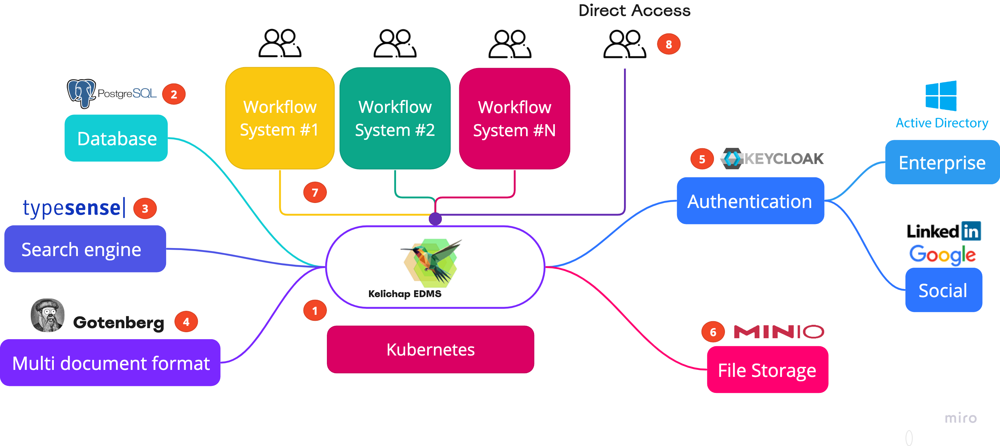

1.  Kelichap is implemented as a single micro-service deployed as a Docker
    container. It can easily be run on any Kubernetes cluster

2.  Kelichap uses PostgeSQL as the database of choice

3.  Kelichap leverages Typesense to implement the fuzzy search function.
    Kelichap supports the search of documents, folder names, as well as notices
    attached to documents.

4.  To support the multitude of document formats such as .docx or .pptx,
    Kelichap uses Gotenberg - an open source engine that translate any MS Office
    documents (and many other formats) to PDF.

5.  Authentication leverages the OIDC protocol through Keycloak. Keycloak would
    enable authentication to be done via Active Directory, Google, LinkedIn and
    many others

6.  In order to scale well at file storage level, Kelichap leverages Minio - an
    AWS S3 compatible object storage open source system. This would make
    Kelichap S3 ready and can easily leverage S3 through simple configuration
    change

7.  Multiple workflow systems can be connected to Kelichap as the common
    document management backend

8.  Kelichap can also be accessed through its UI. Almost every action that can
    be done on the UI, can be done via APIs.

 

### API Specification

API Specification is [here](kelichap-api-spec.html)

Swagger file is [here](kelichap-swagger.json). We recommend using Swagger Editor
to explore the API [<https://editor-next.swagger.io/>]

 

Setting up for production on Kubernetes
---------------------------------------

We highly recommend running Kelichap in a Kubernetes cluster running in, at
least a Multi-AZ setup.

 

>   **A word on Minikube**

>   Running Minikube in production is risky as production support is a non-goal
>   for Minikube
>   <https://minikube.sigs.k8s.io/docs/contrib/principles/#non-goals>

>   That being said, if we are still interested in running Minikube, the Load
>   Balancer service type in Minikube is not tied to an actual cloud load
>   balancer (unlike AWS EKS for example). Deploying a Load Balancer service
>   will only result in an external IP address of the Load Balancer set to
>   \<pending\>. To rectify this, install MetalLB in Minikube:

>   <https://faun.pub/metallb-configuration-in-minikube-to-enable-kubernetes-service-of-type-loadbalancer-9559739787df>

 

The architecture below depicts

 

### Domain name

We advise getting a public domain name for production. Alternatively, we can set
up domain names in our /etc/hosts files. We will leverage these domain names:

-   For Keycloak: id.azrulhasni.my

-   For Kelichap: kelichap.azrulhasni.my

 

### Public TLS certificate

Once we have the domain names, we would need either 2 public TLS certificates
(to cover the 2 domains that we have) or a wildcard TLS certificate. In this
tutorial, we are using Let’s Encrypt but any other provider will do.

 

-   For Let’s Encrypt, firstly, install certbot. Certbot will allow us to
    generate public certificate with ease (no more creating A records) and allow
    for automatic renewal

    ~~~~~~~~~~~~~~~~~~~~~~~~~~~~~~~~~~~~~~~~~~~~~~~~~~~~~~~~~~~~~~~~~~~~~~~~~~~~
    > sudo snap install --classic certbot
    > sudo ln -s /snap/bin/certbot /usr/bin/certbot
    ~~~~~~~~~~~~~~~~~~~~~~~~~~~~~~~~~~~~~~~~~~~~~~~~~~~~~~~~~~~~~~~~~~~~~~~~~~~~

-   Then run certbot for` id.azrulhasni.my`. Firstly, wee need to do a dry run.

    ~~~~~~~~~~~~~~~~~~~~~~~~~~~~~~~~~~~~~~~~~~~~~~~~~~~~~~~~~~~~~~~~~~~~~~~~~~~~
    > sudo certbot certonly --standalone --preferred-challenges http -d 'id.azrulhasni.my' --dry-run
    ~~~~~~~~~~~~~~~~~~~~~~~~~~~~~~~~~~~~~~~~~~~~~~~~~~~~~~~~~~~~~~~~~~~~~~~~~~~~

-   If the dry run is successful, run the same command without the `—dry-run`
    flag

    ~~~~~~~~~~~~~~~~~~~~~~~~~~~~~~~~~~~~~~~~~~~~~~~~~~~~~~~~~~~~~~~~~~~~~~~~~~~~
    > sudo certbot certonly --standalone --preferred-challenges http -d 'id.azrulhasni.my'
    ~~~~~~~~~~~~~~~~~~~~~~~~~~~~~~~~~~~~~~~~~~~~~~~~~~~~~~~~~~~~~~~~~~~~~~~~~~~~

-   A successful creation of our certificate will result in a message as per
    below:

    ~~~~~~~~~~~~~~~~~~~~~~~~~~~~~~~~~~~~~~~~~~~~~~~~~~~~~~~~~~~~~~~~~~~~~~~~~~~~
     Saving debug log to /var/log/letsencrypt/letsencrypt.log
        Requesting a certificate for id.azrulhasni.my

        Successfully received certificate.
        Certificate is saved at: /etc/letsencrypt/live/id.azrulhasni.my/fullchain.pem
        Key is saved at:         /etc/letsencrypt/live/id.azrulhasni.my/privkey.pem
        This certificate expires on 2024-08-24.
        These files will be updated when the certificate renews.
        Certbot has set up a scheduled task to automatically renew this certificate in the background.

        - - - - - - - - - - - - - - - - - - - - - - - - - - - - - - - - - - - - - - - -
        If you like Certbot, please consider supporting our work by:
         * Donating to ISRG / Let's Encrypt:   https://letsencrypt.org/donate
         * Donating to EFF:                    https://eff.org/donate-le
        - - - - - - - - - - - - - - - - - - - - - - - - - - - - - - - - - - - - - - - -
    ~~~~~~~~~~~~~~~~~~~~~~~~~~~~~~~~~~~~~~~~~~~~~~~~~~~~~~~~~~~~~~~~~~~~~~~~~~~~

-   Certbot will create 2 files:

    -   A certificate: /etc/letsencrypt/live/id.azrulhasni.my/fullchain.pem

    -   A key: /etc/letsencrypt/live/id.azrulhasni.my/privkey.pem

-   Repeat the same process for the domain `kelichap.azrulhasni.my`

     

### Database

We only support Postgresql for now. We assume that the database is ready to be
used. Create 2 schemas / databases in there:

-   For Keycloak

-   For Kelichap

 

Note the JDBC URL, user name and password for both and put these configurations
in either the application.properties file or deployment.yaml file

To create the database schema, modify the configuration fields
spring.jpa.hibernate.ddl-auto (in application.properties) or
SPRING_JPA_HIBERNATE_DDLAUTO in deployment.yaml to ‘update'

 

### Installing Minio

-   Create a working directory `minio`and go there

    ~~~~~~~~~~~~~~~~~~~~~~~~~~~~~~~~~~~~~~~~~~~~~~~~~~~~~~~~~~~~~~~~~~~~~~~~~~~~
    > mkdir minio
    > cd minio
    ~~~~~~~~~~~~~~~~~~~~~~~~~~~~~~~~~~~~~~~~~~~~~~~~~~~~~~~~~~~~~~~~~~~~~~~~~~~~

-   From Bitnami’s Minio distribution, download the values.yaml file

    ~~~~~~~~~~~~~~~~~~~~~~~~~~~~~~~~~~~~~~~~~~~~~~~~~~~~~~~~~~~~~~~~~~~~~~~~~~~~
    > wget https://github.com/bitnami/charts/blob/main/bitnami/minio/values.yaml
    ~~~~~~~~~~~~~~~~~~~~~~~~~~~~~~~~~~~~~~~~~~~~~~~~~~~~~~~~~~~~~~~~~~~~~~~~~~~~

-   Update the admin user password in values.yaml. We recommend using Kubernetes
    secrets

    ~~~~~~~~~~~~~~~~~~~~~~~~~~~~~~~~~~~~~~~~~~~~~~~~~~~~~~~~~~~~~~~~~~~~~~~~~~~~
    auth:
      ## @param auth.rootUser MinIO&reg; root username
      ##
      rootUser: admin
      ## @param auth.rootPassword Password for MinIO&reg; root user
      ##
      rootPassword: "<Minio root password. Alternatively, use secret fields below>"
      ## @param auth.existingSecret Use existing secret for credentials details (`auth.rootUser` and `auth.rootPassword` will be ignored and picked up from this secret).
      ##
      existingSecret: "<Minio root user secret name>"
      ## @param auth.rootUserSecretKey Key where the MINIO_ROOT_USER username is being stored inside the existing secret `auth.existingSecret`
      ##
      rootUserSecretKey: "<Minio root user key, pointing to user name>"
      ## @param auth.rootPasswordSecretKey Key where the MINIO_ROOT_USER password is being stored inside the existing secret `auth.existingSecret`
      ##
      rootPasswordSecretKey:  "<Minio root user key, pointing to password>"
    ~~~~~~~~~~~~~~~~~~~~~~~~~~~~~~~~~~~~~~~~~~~~~~~~~~~~~~~~~~~~~~~~~~~~~~~~~~~~

-   Save the file

-   While we are still in the`minio`working directory, run helm

    ~~~~~~~~~~~~~~~~~~~~~~~~~~~~~~~~~~~~~~~~~~~~~~~~~~~~~~~~~~~~~~~~~~~~~~~~~~~~
    > helm install -f values.yaml minio oci://registry-1.docker.io/bitnamicharts/minio
    ~~~~~~~~~~~~~~~~~~~~~~~~~~~~~~~~~~~~~~~~~~~~~~~~~~~~~~~~~~~~~~~~~~~~~~~~~~~~

-   Make sure the minio pods are running by executing the command

    ~~~~~~~~~~~~~~~~~~~~~~~~~~~~~~~~~~~~~~~~~~~~~~~~~~~~~~~~~~~~~~~~~~~~~~~~~~~~
    > kubectl get pods
    ~~~~~~~~~~~~~~~~~~~~~~~~~~~~~~~~~~~~~~~~~~~~~~~~~~~~~~~~~~~~~~~~~~~~~~~~~~~~

    And we will get the information below. Make sure the STATUS is Running and
    READY is n/n

    ~~~~~~~~~~~~~~~~~~~~~~~~~~~~~~~~~~~~~~~~~~~~~~~~~~~~~~~~~~~~~~~~~~~~~~~~~~~~
    NAME                           READY   STATUS    RESTARTS       AGE
    ...
    minio-<random characters>        1/1     Running   0              1m
    ...
    ~~~~~~~~~~~~~~~~~~~~~~~~~~~~~~~~~~~~~~~~~~~~~~~~~~~~~~~~~~~~~~~~~~~~~~~~~~~~

-   Next, we will create a Load Balancer for minio. This will allow external
    parties to access minio console

-   Still in `minio` working directory, create a file called load balancer.yaml.
    Put the content below in the file:

    ~~~~~~~~~~~~~~~~~~~~~~~~~~~~~~~~~~~~~~~~~~~~~~~~~~~~~~~~~~~~~~~~~~~~~~~~~~~~
    apiVersion: v1
    kind: Service
    metadata:
      name: minio-lb
      labels:
        app: minio
    spec:
      ports:
      - name: tcp-9000
        protocol: TCP
        port: 9000
        targetPort: 9000
      - name: tcp-9001
        protocol: TCP
        port: 9001
        targetPort: 9001
      selector:
        app.kubernetes.io/instance: minio
        app.kubernetes.io/name: minio
      type: LoadBalancer 
    ~~~~~~~~~~~~~~~~~~~~~~~~~~~~~~~~~~~~~~~~~~~~~~~~~~~~~~~~~~~~~~~~~~~~~~~~~~~~

    9000 is the minio API port and 9001 is the mini console port. Change them
    accordingly if you have moodier them in the helm values.yaml before.

-   Apply the load balancer

    ~~~~~~~~~~~~~~~~~~~~~~~~~~~~~~~~~~~~~~~~~~~~~~~~~~~~~~~~~~~~~~~~~~~~~~~~~~~~
    > kubectl apply -f loadbalancer.yaml
    ~~~~~~~~~~~~~~~~~~~~~~~~~~~~~~~~~~~~~~~~~~~~~~~~~~~~~~~~~~~~~~~~~~~~~~~~~~~~

-   Check if the load balancer is applied correctly.

    ~~~~~~~~~~~~~~~~~~~~~~~~~~~~~~~~~~~~~~~~~~~~~~~~~~~~~~~~~~~~~~~~~~~~~~~~~~~~
    > kubectl get services
    ~~~~~~~~~~~~~~~~~~~~~~~~~~~~~~~~~~~~~~~~~~~~~~~~~~~~~~~~~~~~~~~~~~~~~~~~~~~~

    And we should see the information below. Note the EXTERNAL-IP:

    ~~~~~~~~~~~~~~~~~~~~~~~~~~~~~~~~~~~~~~~~~~~~~~~~~~~~~~~~~~~~~~~~~~~~~~~~~~~~
    NAME             TYPE           CLUSTER-IP       EXTERNAL-IP     PORT(S)                           AGE
    ...
    minio-lb         LoadBalancer   10.102.53.83     192.168.49.13   9000:30172/TCP,9001:31986/TCP     7h28m
    ...
    ~~~~~~~~~~~~~~~~~~~~~~~~~~~~~~~~~~~~~~~~~~~~~~~~~~~~~~~~~~~~~~~~~~~~~~~~~~~~

-   Try to access the external IP address from curl and we should get back some
    HTML data

    ~~~~~~~~~~~~~~~~~~~~~~~~~~~~~~~~~~~~~~~~~~~~~~~~~~~~~~~~~~~~~~~~~~~~~~~~~~~~
    curl -L http://192.168.49.13:9001

    <!doctype html><html lang="en"><head><meta charset="utf-8"/><base href="/"/><meta content="width=device-width,initial-scale=1" name="viewport"/><meta content="#081C42" media="(prefers-color-scheme: light)" name="theme-color"/><meta content="#081C42" media="(prefers-color-scheme: dark)" name="theme-color"/><meta content="MinIO Console" name="description"/><meta name="minio-license" content="agpl" /><link href="./styles/root-styles.css" rel="stylesheet"/><link href="./apple-icon-180x180.png" rel="apple-touch-icon" sizes="180x180"/><link href="./favicon-32x32.png" rel="icon" sizes="32x32" type="image/png"/><link href="./favicon-96x96.png" rel="icon" sizes="96x96" type="image/png"/><link href="./favicon-16x16.png" rel="icon" sizes="16x16" type="image/png"/><link href="./manifest.json" rel="manifest"/><link color="#3a4e54" href="./safari-pinned-tab.svg" rel="mask-icon"/><title>MinIO Console</title><link href="./static/css/main.e60e4760.css" rel="stylesheet"></head><body><noscript>You need to enable JavaScript to run this app.</noscript>

 

</body></html>
    ~~~~~~~~~~~~~~~~~~~~~~~~~~~~~~~~~~~~~~~~~~~~~~~~~~~~~~~~~~~~~~~~~~~~~~~~~~~~

 

### Configuring Minio

-   Firstly, ensure that Minio console is accessible (on port 9001) through the
    browser. If not, expose it through firewall and load balancer.
    Alternatively, configuration under the paragraph Nginx below can be used

-   Once Minio Console is accessible login with Minio admin and password

    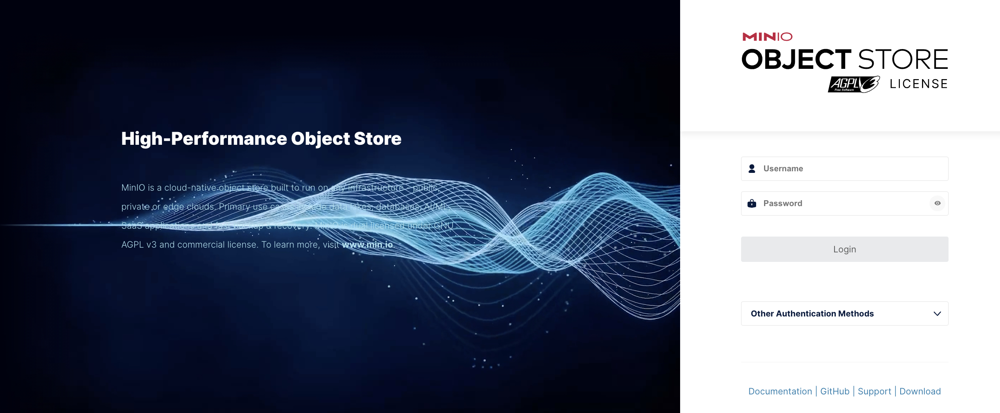

 

-   Under Buckets \> Create Bucket. Put the name kelichap and click soon ‘Create
    Bucket'

    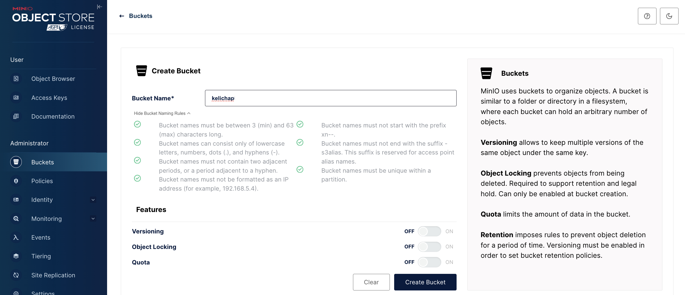

-   Then click on Identity \> Users \> Create User

-   Create the user kelichap, give it a password and choose ‘readwrite’ in the
    policy. Click on ’Save'

    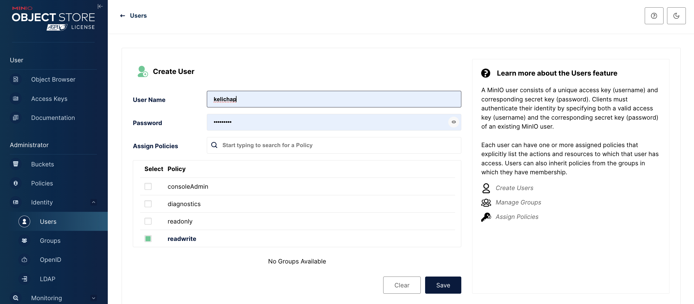

 

-   Then go to Buckets \> kelichap \> Access \> Users. Make sure that the user
    kelichap is there in the list

    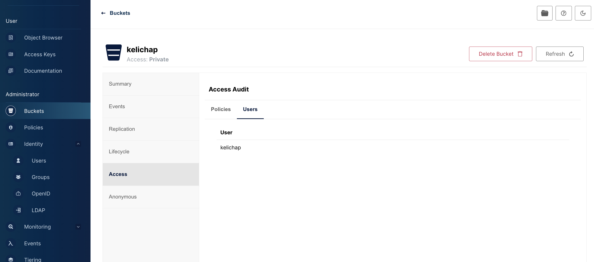

 

-   Enter Minio’s configuration into the application.properties file (for
    development) or the deployment.yaml file (for test & production ). Seee
    **Minio configuration** paragraph  under Configuration

 

### Installing Typesense

-   The way to install Typesense in a Kubernetes cluster is to use Typesense
    Kubernetes Operator

-   Follow the instruction stated here:
    <https://github.com/sai3010/Typesense-Kubernetes-Operator>

-   Although there are alternative ways to install Typesense in a Kuberneetes
    cluster, the operator way is the best:

    -   Officially mentioned in Typesense documentation (although it is
        community supported)

    -   The operator takes care of clustering (peering etc.) and thus simplify
        production setup. Without the operator, we have to manually (and also
        constantly) update peering information for the Typesense nodes

-   Note:

    -   For a production deployment, we may want to change a few parameters in
        the operator-config.yaml file

        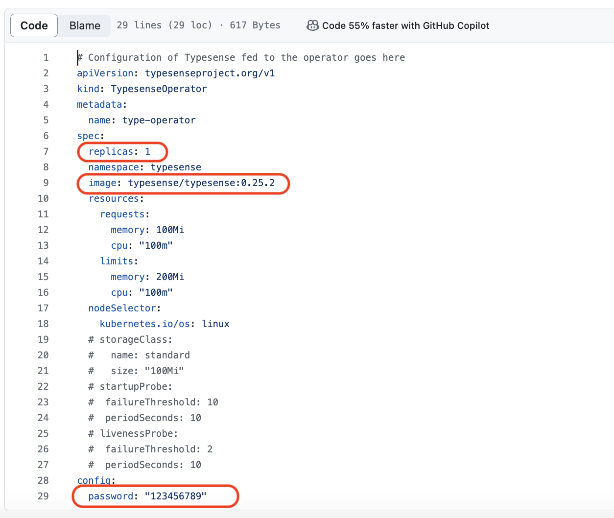

        -   Change replica to 3

        -   Use the latest typesense version (as of this writing, that would be
            version 26.0)

        -   Change password. The password here is the Typesense API key

         

-   When installation is complete, we can query our Kubernetes pods to see if
    all is well. Make sure the STATUS is Running and READY is n/n

    ~~~~~~~~~~~~~~~~~~~~~~~~~~~~~~~~~~~~~~~~~~~~~~~~~~~~~~~~~~~~~~~~~~~~~~~~~~~~
    > kubectl get pods -n typesense
    NAME          READY   STATUS    RESTARTS       AGE
    ...
    typesense-0   1/1     Running   0              1m
    typesense-1   1/1     Running   0              1m
    typesense-2   1/1     Running   0              1m
    ...
    ~~~~~~~~~~~~~~~~~~~~~~~~~~~~~~~~~~~~~~~~~~~~~~~~~~~~~~~~~~~~~~~~~~~~~~~~~~~~

-   In the same `typsesense `folder, create a file called loadbalancer.yaml

    ~~~~~~~~~~~~~~~~~~~~~~~~~~~~~~~~~~~~~~~~~~~~~~~~~~~~~~~~~~~~~~~~~~~~~~~~~~~~
    apiVersion: v1
    kind: Service
    metadata:
      name: typesense-lb
      namespace: typesense
      labels:
        app: typesense-lb
    spec:
      ports:
      - name: tcp-8108
        protocol: TCP
        port: 8108
        targetPort: typesense-http
      selector:
        app: typesense
      type: LoadBalancer
    ~~~~~~~~~~~~~~~~~~~~~~~~~~~~~~~~~~~~~~~~~~~~~~~~~~~~~~~~~~~~~~~~~~~~~~~~~~~~

-   Apply the loadbalancer

    ~~~~~~~~~~~~~~~~~~~~~~~~~~~~~~~~~~~~~~~~~~~~~~~~~~~~~~~~~~~~~~~~~~~~~~~~~~~~
    > kubectl apply -f loadbalancer.yaml 
    ~~~~~~~~~~~~~~~~~~~~~~~~~~~~~~~~~~~~~~~~~~~~~~~~~~~~~~~~~~~~~~~~~~~~~~~~~~~~

-   Query its status

    ~~~~~~~~~~~~~~~~~~~~~~~~~~~~~~~~~~~~~~~~~~~~~~~~~~~~~~~~~~~~~~~~~~~~~~~~~~~~
    > kubectl get services
    ~~~~~~~~~~~~~~~~~~~~~~~~~~~~~~~~~~~~~~~~~~~~~~~~~~~~~~~~~~~~~~~~~~~~~~~~~~~~

-   The result should be as per below. Do note the EXTERNAL-IP of our Typesense
    Load Balancer

    ~~~~~~~~~~~~~~~~~~~~~~~~~~~~~~~~~~~~~~~~~~~~~~~~~~~~~~~~~~~~~~~~~~~~~~~~~~~~
    NAME             TYPE           CLUSTER-IP       EXTERNAL-IP     PORT(S)                           AGE
    ...
    typesense-lb     LoadBalancer   10.101.98.60     192.168.49.14   8108:31163/TCP                    1s
    ...
    ~~~~~~~~~~~~~~~~~~~~~~~~~~~~~~~~~~~~~~~~~~~~~~~~~~~~~~~~~~~~~~~~~~~~~~~~~~~~

-   To test Typesense, firstly, export the API key we specified in the
    values.yaml fiile above

    ~~~~~~~~~~~~~~~~~~~~~~~~~~~~~~~~~~~~~~~~~~~~~~~~~~~~~~~~~~~~~~~~~~~~~~~~~~~~
    > export TYPESENSE_API_KEY=<Typesense key>
    ~~~~~~~~~~~~~~~~~~~~~~~~~~~~~~~~~~~~~~~~~~~~~~~~~~~~~~~~~~~~~~~~~~~~~~~~~~~~

-   Then run the query below. Note that the IP address 192.168.49.14 is the
    EXTERNAL-IP address above

    ~~~~~~~~~~~~~~~~~~~~~~~~~~~~~~~~~~~~~~~~~~~~~~~~~~~~~~~~~~~~~~~~~~~~~~~~~~~~
    > curl -H "X-TYPESENSE-API-KEY: ${TYPESENSE_API_KEY}" -X GET  "http://192.168.49.14:8108/collections/"|jq
    ~~~~~~~~~~~~~~~~~~~~~~~~~~~~~~~~~~~~~~~~~~~~~~~~~~~~~~~~~~~~~~~~~~~~~~~~~~~~

-   The result should be as per below. Note that if we have collections in
    Typesense, we will get the list of collections in the `[]`. This indicates
    that our installation is successful

    ~~~~~~~~~~~~~~~~~~~~~~~~~~~~~~~~~~~~~~~~~~~~~~~~~~~~~~~~~~~~~~~~~~~~~~~~~~~~
      % Total    % Received % Xferd  Average Speed   Time    Time     Time  Current
                                     Dload  Upload   Total   Spent    Left  Speed
    100  2666    0  2666    0     0  1286k      0 --:--:-- --:--:-- --:--:-- 2603k
    []
    ~~~~~~~~~~~~~~~~~~~~~~~~~~~~~~~~~~~~~~~~~~~~~~~~~~~~~~~~~~~~~~~~~~~~~~~~~~~~

 

### Configuring Typesense

**Document collection schema**

-   Next we will add a collection to Typesense. Run the curl command below. Note
    the IP address used must be the same as above

    ~~~~~~~~~~~~~~~~~~~~~~~~~~~~~~~~~~~~~~~~~~~~~~~~~~~~~~~~~~~~~~~~~~~~~~~~~~~~
    curl "http://192.168.49.14:8108/collections" -X POST -H "Content-Type: application/json" -H "X-TYPESENSE-API-KEY: ${TYPESENSE_API_KEY}" -d '{
             "name": "kelichap-documents",
             "fields": [
               {"name": "id", "type": "string" , "sort": true },
               {"name": "type_", "type": "string", "sort": true },
               {"name": "docId", "type": "int64" },
               {"name": "tags", "type": "string[]" ,"optional": true},
               {"name": "readers", "type": "string[]" },
               {"name": "workflowId", "type": "string", "sort": true, "optional": true},
               {"name": "folderName", "type": "string", "sort": true  },
               {"name": "folderId", "type": "int64" },
               {"name": "rootFolderId", "type": "int64" },
               {"name": "page", "type": "int32" },
               {"name": "fileName", "type": "string", "sort": true },
               {"name": "size", "type": "int32", "optional": true},
               {"name": "latest", "type": "bool" },
               {"name": "active", "type": "bool" },
               {"name": "pathToRoot", "type": "int64[]" },
               {"name": "version", "type": "int32" },
               {"name": "writerUserName", "type": "string", "optional": true, "sort": true },
               {"name": "writerFullName", "type": "string", "optional": true, "sort": true  },
               {"name": "writtenDate", "type": "int64", "optional": true, "sort": true  },
               {"name": "content", "type": "string" }
             ]
           }'|jq
    ~~~~~~~~~~~~~~~~~~~~~~~~~~~~~~~~~~~~~~~~~~~~~~~~~~~~~~~~~~~~~~~~~~~~~~~~~~~~

-   If all is well, we will get back the collection in json form

    ~~~~~~~~~~~~~~~~~~~~~~~~~~~~~~~~~~~~~~~~~~~~~~~~~~~~~~~~~~~~~~~~~~~~~~~~~~~~
      % Total    % Received % Xferd  Average Speed   Time    Time     Time  Current
                                     Dload  Upload   Total   Spent    Left  Speed
    100  2666    0  2666    0     0  1286k      0 --:--:-- --:--:-- --:--:-- 2603k
    [ "created_at": 1716347335,
        "default_sorting_field": "",
        "enable_nested_fields": false,
        "fields": [
          {
            "facet": false,
            "index": true,
        ...
    ]
    ~~~~~~~~~~~~~~~~~~~~~~~~~~~~~~~~~~~~~~~~~~~~~~~~~~~~~~~~~~~~~~~~~~~~~~~~~~~~

 

**User collection schema and alias**

-   For users search schema, in addition to creating a collection, we must alsoo
    create an alias. An alias is a ‘pointer’ to a collection (much like symlink
    in Unix). This will allow us to load users in the background without
    affecting search

-   The workflow is as follows:

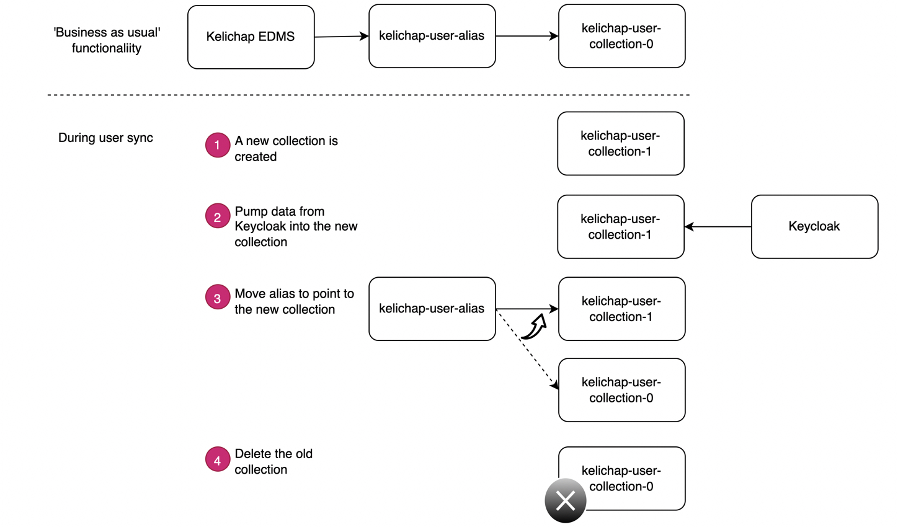

-   Note that Kelichap will create thee new collections as and when needed but
    the first collection and alias must be created manually (or through an
    automated CD pipeline) before Kelichap is started.

-   Create the user collection

    ~~~~~~~~~~~~~~~~~~~~~~~~~~~~~~~~~~~~~~~~~~~~~~~~~~~~~~~~~~~~~~~~~~~~~~~~~~~~
    curl "http://192.168.49.14:8108/collections" -X POST -H "Content-Type: application/json" -H "X-TYPESENSE-API-KEY: ${TYPESENSE_API_KEY}" -d '{
             "name": "kelichap-users-0",
             "fields": [
               {"name": "id", "type": "string" , "sort": true },
               {"name": "username", "type": "string" , "sort": true },
               {"name": "firstName", "type": "string", "sort": true },
               {"name": "lastName", "type": "string", "sort": true },
               {"name": "email", "type": "string", "sort": true }
             ]
           }'|jq
    ~~~~~~~~~~~~~~~~~~~~~~~~~~~~~~~~~~~~~~~~~~~~~~~~~~~~~~~~~~~~~~~~~~~~~~~~~~~~

-   Create the alias. Note that we use the name of the collection
    (kelichap-users-0) in the API input

    ~~~~~~~~~~~~~~~~~~~~~~~~~~~~~~~~~~~~~~~~~~~~~~~~~~~~~~~~~~~~~~~~~~~~~~~~~~~~
    curl "http://192.168.49.14:8108/aliases/kelichap-users" -X PUT     -H "Content-Type: application/json"     -H "X-TYPESENSE-API-KEY: ${TYPESENSE_API_KEY}" -d '{
            "collection_name": "kelichap-users-0"
        }'
    ~~~~~~~~~~~~~~~~~~~~~~~~~~~~~~~~~~~~~~~~~~~~~~~~~~~~~~~~~~~~~~~~~~~~~~~~~~~~

-   Enter Typesense’s configuration into the application.properties file (for
    development) or the deployment.yaml file (for test & production ). See
    **Typesense configuration** paragraph under Configuration

 

### Installing Gotenberg

-   To install Gotenberg, just run the helm command below

    ~~~~~~~~~~~~~~~~~~~~~~~~~~~~~~~~~~~~~~~~~~~~~~~~~~~~~~~~~~~~~~~~~~~~~~~~~~~~
    > helm install my-gotenberg maikumori/gotenberg
    ~~~~~~~~~~~~~~~~~~~~~~~~~~~~~~~~~~~~~~~~~~~~~~~~~~~~~~~~~~~~~~~~~~~~~~~~~~~~

-   Query our Kubernetes pods to see if all is well. Make sure the STATUS is
    Running and READY is n/n

    ~~~~~~~~~~~~~~~~~~~~~~~~~~~~~~~~~~~~~~~~~~~~~~~~~~~~~~~~~~~~~~~~~~~~~~~~~~~~
    NAME                           READY   STATUS    RESTARTS       AGE
    ...
    my-gotenberg-<random characters> 1/1     Running       0        1m
    .    ..
    ~~~~~~~~~~~~~~~~~~~~~~~~~~~~~~~~~~~~~~~~~~~~~~~~~~~~~~~~~~~~~~~~~~~~~~~~~~~~

-   Enter Gotenberg’s configuration into the application.properties file (for
    development) or the deployment.yaml file (for test & production ). See
    **Gotenberg configuration** paragraph under Configuration

 

### Installing Keycloak

-   We will install Keycloak on a plain Ubuntu Linux VM. Any other OS / Linux
    bistro will also do. Optionally, Keycloak can also be installed on the
    Kubernetes cluster. We leave that as an exercise for a the reader.

-   Install Java

    ~~~~~~~~~~~~~~~~~~~~~~~~~~~~~~~~~~~~~~~~~~~~~~~~~~~~~~~~~~~~~~~~~~~~~~~~~~~~
    > sudo apt-get install openjdk-17-jdk
    ~~~~~~~~~~~~~~~~~~~~~~~~~~~~~~~~~~~~~~~~~~~~~~~~~~~~~~~~~~~~~~~~~~~~~~~~~~~~

-   Download Keycloak and create a keycloak user to own Keycloak

    ~~~~~~~~~~~~~~~~~~~~~~~~~~~~~~~~~~~~~~~~~~~~~~~~~~~~~~~~~~~~~~~~~~~~~~~~~~~~
    > cd /opt 
    > sudo wget https://github.com/keycloak/keycloak/releases/download/24.0.4/keycloak-24.0.4.tar.gz

    > sudo tar -xvf keycloak-24.0.4.tar.gz

    > sudo groupadd keycloak
    > sudo useradd -r -g keycloak -d /opt/keycloak -s /sbin/nologin keycloak
    > sudo mv keycloak-24.0.4 keycloak
    > sudo chmod o+x /opt/keycloak/bin

    > sudo chown keycloak: /opt/keycloak/bin/kc.sh
    ~~~~~~~~~~~~~~~~~~~~~~~~~~~~~~~~~~~~~~~~~~~~~~~~~~~~~~~~~~~~~~~~~~~~~~~~~~~~

-   Register Keycloak in Systemctl so that it would start and stop
    automatically. To do that, firstly create the file keycloak.service

    ~~~~~~~~~~~~~~~~~~~~~~~~~~~~~~~~~~~~~~~~~~~~~~~~~~~~~~~~~~~~~~~~~~~~~~~~~~~~
    > cd /etc/systemd/system
    > sudo vim keycloak.service 
    ~~~~~~~~~~~~~~~~~~~~~~~~~~~~~~~~~~~~~~~~~~~~~~~~~~~~~~~~~~~~~~~~~~~~~~~~~~~~

-   In the file, put in these configurations. Both `KC_HOSTNAME_URL` and
    `KC_HOSTNAME_ADMIN_URL` must contain the front-end URL (i.e. the Load
    Balancer URL) and they must be equal

    ~~~~~~~~~~~~~~~~~~~~~~~~~~~~~~~~~~~~~~~~~~~~~~~~~~~~~~~~~~~~~~~~~~~~~~~~~~~~
    [Unit]
    Description=Keycloak Authorization Server
    After=network.target

    [Service]
    User=keycloak
    Group=keycloak
    ExecStart=/opt/keycloak/bin/kc.sh start --verbose
    ExecStop=/opt/keycloak/bin/kc.sh stop
    Restart=always
    RestartSec=3

    Environment="JAVA_HOME=/usr/lib/jvm/java-17-openjdk-amd64"
    Environment="DB_VENDOR=postgres"
    Environment="DB_ADDR=kelichapdb-do-user-8723204-0.c.db.ondigitalocean.com"
    Environment="DB_PORT=25060"
    Environment="DB_DATABASE=keycloak"
    Environment="DB_USER=keycloak"
    Environment="DB_PASSWORD=<Database password>"
    Environment="KEYCLOAK_JDBC_PARAMS='sslmode=require'"

    Environment="KC_HTTP_ENABLED=true"
    Environment="KC_HTTPS_CERTIFICATE_FILE=/etc/keycloak/fullchain.pem"
    Environment="KC_HTTPS_CERTIFICATE_KEY_FILE=/etc/keycloak/privkey.pem"
    #both KC_HOSTNAME_URL & KC_HOSTNAME_ADMIN_URL must be set to equal. If not, Keycloak login page (for both user and admin) will loop and showing Loading The Admin UI 
    Environment="KC_HOSTNAME_URL=https://id.azrulhasni.my"
    Environment="KC_HOSTNAME_ADMIN_URL=https://id.azrulhasni.my" 
    Environment="KC_HOSTNAME_STRICT_BACKCHANNEL=true"
    Environment="KC_HTTPS_PORT=8443"
    Environment="KC_PROXY_HEADERS=forwarded"
    Environment="KC_PROXY=reencrypt"
    Environment="KC_HOSTNAME_STRICT=false"

    [Install]
    WantedBy=multi-user.target
    ~~~~~~~~~~~~~~~~~~~~~~~~~~~~~~~~~~~~~~~~~~~~~~~~~~~~~~~~~~~~~~~~~~~~~~~~~~~~

 

-   Copying certificates for Keycloak domain

    Specifically for Keycloak domain (id.azrulhasni.my), we will need to copy it
    somewhere safe and yet usable by keycloak. This is because Keycloak is not
    running as root (for security reasons) and therefore will not have direct
    access to the folder /etc/letsencrypt/live/

     

    ~~~~~~~~~~~~~~~~~~~~~~~~~~~~~~~~~~~~~~~~~~~~~~~~~~~~~~~~~~~~~~~~~~~~~~~~~~~~
    > cp  /etc/letsencrypt/live/id.azrulhasni.my/fullchain.pem /etc/keycloak
    > cp  /etc/letsencrypt/live/id.azrulhasni.my/privkey.pem /etc/keycloak

    > sudo chown -R keycloak:keycloak /etc/keycloak
    > sudo chmod -R 700 /etc/keycloak
    ~~~~~~~~~~~~~~~~~~~~~~~~~~~~~~~~~~~~~~~~~~~~~~~~~~~~~~~~~~~~~~~~~~~~~~~~~~~~

 

-   Next, we will set up systemctl. Note that any change to the keycloak.service
    file above, both daemon-reload and restart of Keycloak must be done.

    ~~~~~~~~~~~~~~~~~~~~~~~~~~~~~~~~~~~~~~~~~~~~~~~~~~~~~~~~~~~~~~~~~~~~~~~~~~~~
    > sudo systemctl daemon-reload
    > sudo systemctl start keycloak.service 
    > sudo systemctl status keycloak.service
    ~~~~~~~~~~~~~~~~~~~~~~~~~~~~~~~~~~~~~~~~~~~~~~~~~~~~~~~~~~~~~~~~~~~~~~~~~~~~

 

-   If all goes well, pointing your browser to https://id.azrulhasni.my will
    land you on Keycloak’s admiin log in page

    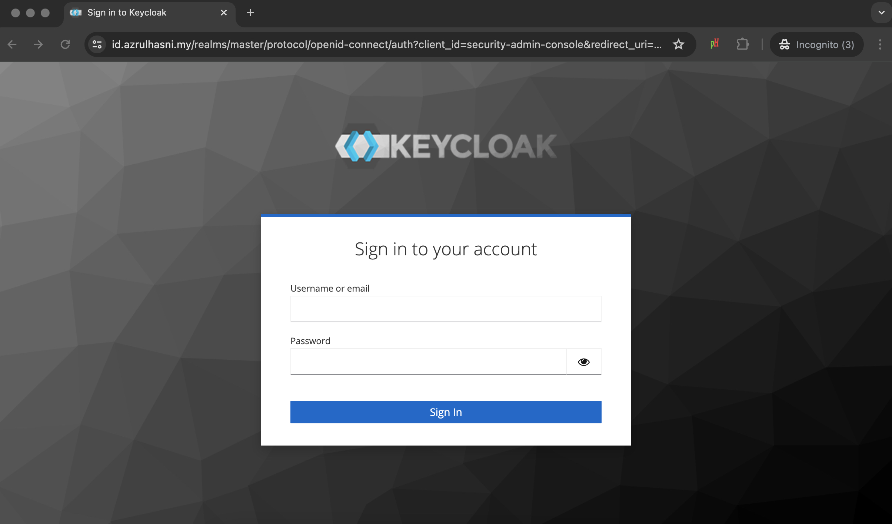

 

### Configuring Keycloak

**Setting up Kelichap realm**

-   Download the realm export file:
    <https://github.com/azrulhasni/kelichap/blob/main/keycloak/kelichap-realm-export.json>

-   Log in as admin in Keycloak

-   Create a realm and import the kelichap-realm-export.json file. This will
    create the Kelichap realm with the needed client and roles.

    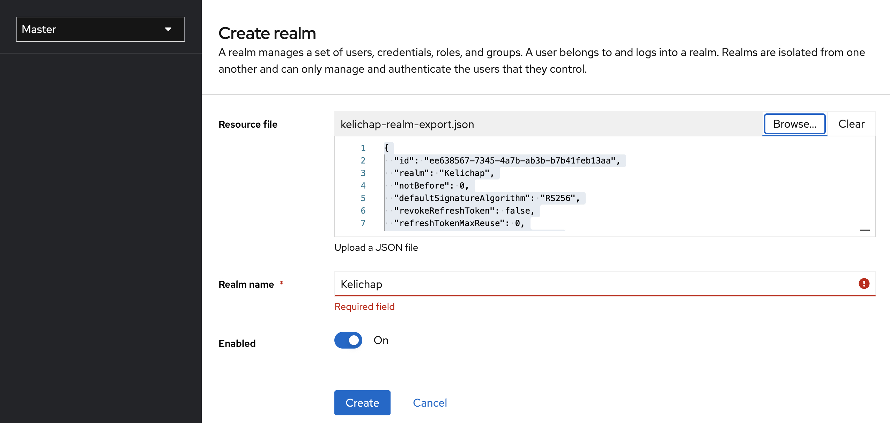

-   Click on ‘Create’ button

 

**Creating users**

-   Once the Kelichap realm is created, we can create a user. Log in to Keycloak
    as admin if we haven’t done so. On the side menu, select the Keelichap realm
    created before

    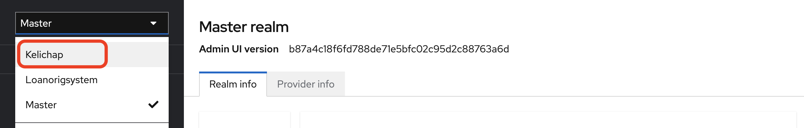

-   On the side panel, choose User \> Create New User. Fill in the form. Below
    we create an example user named Buyong Adil (btw, Buyong Adil is a prominent
    Malaysian historian <https://ms.wikipedia.org/wiki/Buyong_Adil>)

    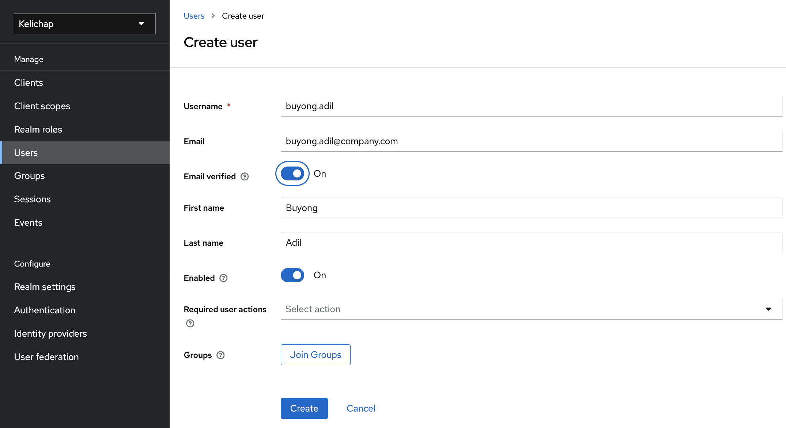

-   Click on Create - the user will be created

-   A new page will appear, go to the Credential page to setup the user’s
    password

-   Alternatively, we can link Kelichap to Active Directory or LDAP through
    Keycloak. Such authentication is called federated authentication. For more
    information, please see here
    [<https://www.keycloak.org/docs/latest/server_admin/#_ldap>]

 

**Assigning roles**

-   Under a particular user page, go to the Role Mapping tab and click on Assign
    Role

-   A new window will appear, click on the drop down list ‘Filter by roles’ and
    choose ‘Filter by clients'

    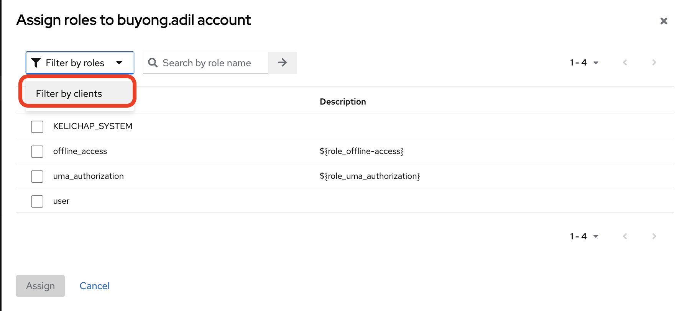

-   Choose ‘KELICHAP_USER’ and click on Assign

    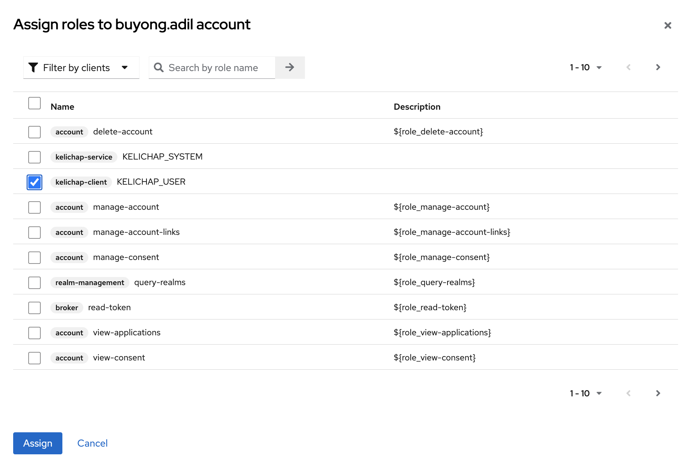

-   Click on Assign Role again and choose:

    -   offline_access

    -   uma_authorization

    -   user

    Click on Assign

    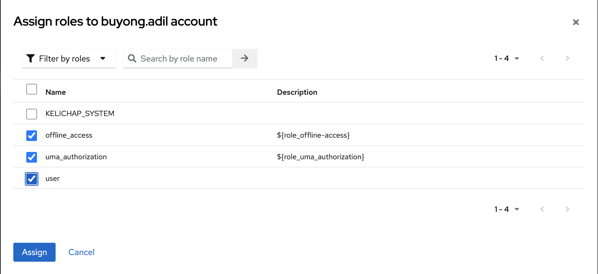

 

-   The end result should be as per below:

    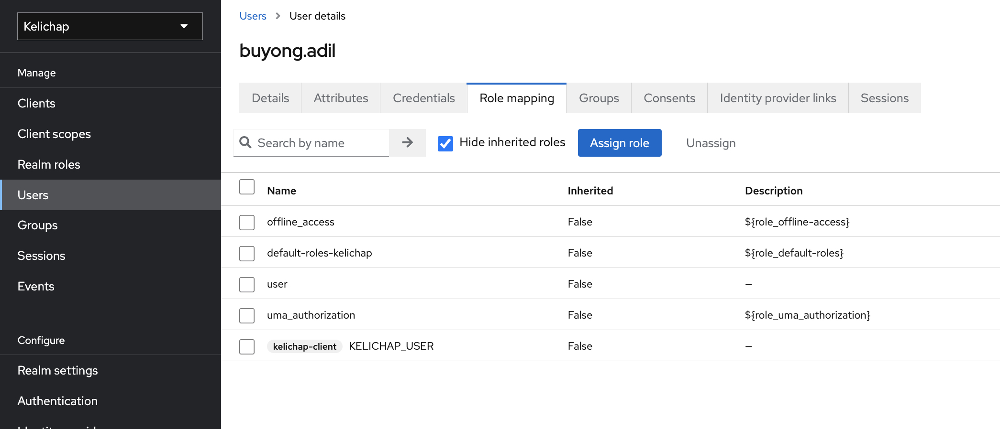

 

-   Repeate role assignment for all users. This includes any user from federated
    user store such as Active Directory or LDAP.

 

**System user**

-   It is compulsory to create a system user with the specification below:

    -   User name: kelichap

    -   Password: any password - this password must be passed to the
        configuration file or deployed as secret

    -   Roles:

        -   `KELICHAP_USER`under kelichap-client

        -   `view-users` under realm-management (as depicted below)

            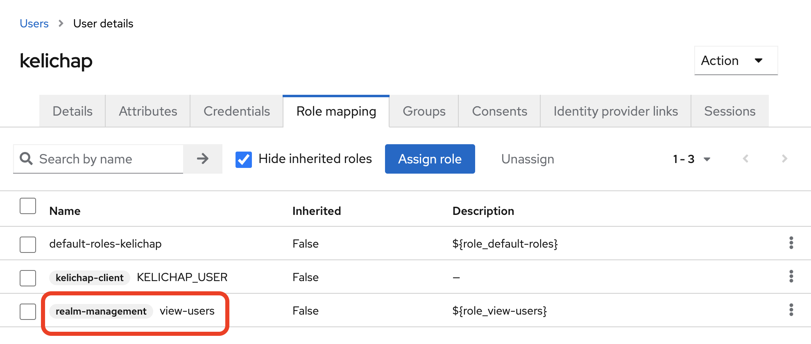

 

 

**Active Directory / LDAP**

-   Kelichap supports using Active Directory / LDAP to store user information
    and credential by leveraging Keycloak.To link Keycloak to Active Directory /
    LDAP, follow this tutorial
    <https://www.keycloak.org/docs/latest/server_admin/#_user-storage-federation>

-   When our users are stored in Active Directory / LDAP, we need to make sure
    that we map appropriate Keycloak roles to these users.

-   One way to map users to a role is to leverage Mappers. Under Kelichap
    (Realm) \> User Federation. Choose the federation we created and choose the
    Mapper tab

-   We can create, for example, a hardcoded mapper that maps any user in Active
    Diirectoory / LDAP to the rrole ‘KELICHAP_USER'

    

###  

**Synchronising Keycloak users to Typesense**

-   Kelichap allows quick search of users (for example, to be assigned to a
    folder). To achieve this, we must, from time to time, copy users from
    Keycloak to Typesense - our search engine.

-   To do this, firstly we need to configure a lock. At any point, we might have
    multiple instances (i.e. Kubernetes pod) of Kelichap running. When a
    synchronisation job is run, we do not want all the instances to run the same
    job - and thus create conflict. To help with this, we will create a lock in
    the database. The first instance to obtain this lock will run the
    synchronisation job

-   First, connect to your database and create the table below. We assume that
    the database user is named ‘kelichap’. The name of the table must be
    ’shedlock'

    ~~~~~~~~~~~~~~~~~~~~~~~~~~~~~~~~~~~~~~~~~~~~~~~~~~~~~~~~~~~~~~~~~~~~~~~~~~~~
    > CREATE TABLE IF NOT EXISTS public.shedlock
    (
        name character varying(64) COLLATE pg_catalog."default" NOT NULL,
        lock_until timestamp(3) without time zone,
        locked_at timestamp(3) without time zone,
        locked_by character varying(255) COLLATE pg_catalog."default",
        CONSTRAINT shedlock_pkey PRIMARY KEY (name)
    )

    TABLESPACE pg_default;

    ALTER TABLE IF EXISTS public.shedlock
        OWNER to kelichap;
    ~~~~~~~~~~~~~~~~~~~~~~~~~~~~~~~~~~~~~~~~~~~~~~~~~~~~~~~~~~~~~~~~~~~~~~~~~~~~

-   Update the configuration as perr the paragraph **User sync configuration**
    below and wee are good to go

 

**Update Kelichap configuration file**

-   Enter Keycloak’s configuration into the application.properties file (for
    development) or the deployment.yaml file (for test & production ). Seee
    **Keycloak configuration** paragraph under Configuration

 

 

### Installing Kelichap

-   Create a working directory `kelichap` and move there

    ~~~~~~~~~~~~~~~~~~~~~~~~~~~~~~~~~~~~~~~~~~~~~~~~~~~~~~~~~~~~~~~~~~~~~~~~~~~~
    > mkdir kelichap
    > cd kelichap
    ~~~~~~~~~~~~~~~~~~~~~~~~~~~~~~~~~~~~~~~~~~~~~~~~~~~~~~~~~~~~~~~~~~~~~~~~~~~~

-   Download Kelichap’s deployment.yaml file into the directory

    ~~~~~~~~~~~~~~~~~~~~~~~~~~~~~~~~~~~~~~~~~~~~~~~~~~~~~~~~~~~~~~~~~~~~~~~~~~~~
    > wget https://raw.githubusercontent.com/azrulhasni/kelichap/main/deployment.yaml
    ~~~~~~~~~~~~~~~~~~~~~~~~~~~~~~~~~~~~~~~~~~~~~~~~~~~~~~~~~~~~~~~~~~~~~~~~~~~~

-   Customise the s`pec.template.spec.containers[0].env` as per the
    Configuration paragraph below

-   Apply the deployment file

    ~~~~~~~~~~~~~~~~~~~~~~~~~~~~~~~~~~~~~~~~~~~~~~~~~~~~~~~~~~~~~~~~~~~~~~~~~~~~
    > kubectl apply -f deployment.yaml
    ~~~~~~~~~~~~~~~~~~~~~~~~~~~~~~~~~~~~~~~~~~~~~~~~~~~~~~~~~~~~~~~~~~~~~~~~~~~~

-   Query our Kubernetes pods to see if all is well. Make sure the STATUS is
    Running and READY is n/n

    ~~~~~~~~~~~~~~~~~~~~~~~~~~~~~~~~~~~~~~~~~~~~~~~~~~~~~~~~~~~~~~~~~~~~~~~~~~~~
    NAME                           READY   STATUS    RESTARTS       AGE
    ...
    kelichap-<random characters>   1/1     Running   0             1m
    .    ..
    ~~~~~~~~~~~~~~~~~~~~~~~~~~~~~~~~~~~~~~~~~~~~~~~~~~~~~~~~~~~~~~~~~~~~~~~~~~~~

-   Create a file called loadbalancer.yaml in the `kelichap` working directory.
    Put the content below:

    ~~~~~~~~~~~~~~~~~~~~~~~~~~~~~~~~~~~~~~~~~~~~~~~~~~~~~~~~~~~~~~~~~~~~~~~~~~~~
    apiVersion: v1
    kind: Service
    metadata:
      name: kelichap
      labels:
        app: kelichap
    spec:
      ports:
      - name: tcp-18080
        protocol: TCP
        port: 18080
        targetPort: 18080
      selector:
        app: kelichap
      type: LoadBalancer
    ~~~~~~~~~~~~~~~~~~~~~~~~~~~~~~~~~~~~~~~~~~~~~~~~~~~~~~~~~~~~~~~~~~~~~~~~~~~~

-   Apply the load balancer

    ~~~~~~~~~~~~~~~~~~~~~~~~~~~~~~~~~~~~~~~~~~~~~~~~~~~~~~~~~~~~~~~~~~~~~~~~~~~~
    > kubectl apply -f loadbalancer.yaml
    ~~~~~~~~~~~~~~~~~~~~~~~~~~~~~~~~~~~~~~~~~~~~~~~~~~~~~~~~~~~~~~~~~~~~~~~~~~~~

-   Query the load balancer. Note the EXTERNAL-IP in the result

    ~~~~~~~~~~~~~~~~~~~~~~~~~~~~~~~~~~~~~~~~~~~~~~~~~~~~~~~~~~~~~~~~~~~~~~~~~~~~
    > kubectl get services
    NAME             TYPE           CLUSTER-IP       EXTERNAL-IP     PORT(S)                           AGE
    ...
    kelichap         LoadBalancer   10.111.244.38    192.168.49.12   18080:32043/TCP                   1m
    ~~~~~~~~~~~~~~~~~~~~~~~~~~~~~~~~~~~~~~~~~~~~~~~~~~~~~~~~~~~~~~~~~~~~~~~~~~~~

 

-   Curl to the EXTERNAL-IP on the exposed port. If all is well, curl should
    return without any content

    ~~~~~~~~~~~~~~~~~~~~~~~~~~~~~~~~~~~~~~~~~~~~~~~~~~~~~~~~~~~~~~~~~~~~~~~~~~~~
    curl -L http://192.168.49.12:18080
    ~~~~~~~~~~~~~~~~~~~~~~~~~~~~~~~~~~~~~~~~~~~~~~~~~~~~~~~~~~~~~~~~~~~~~~~~~~~~

 

### Load balancer

Each cloud service provider would have a different load balancer. Because of
this, we consider load balancer configuration should not be part oof Kelichap’s
documentation.

 

### Nginx

if we would like to expose Kelichap’s two domain names (in our
example:`id.azrulhasni.my` and `kelichap.azrulhasni.my`), we could use Nginx.
The steps to install is as per below:

-   Firstly, adjust your firewall to accept traffic on ports 80, 443 (for
    Kelichap) as well as 9000 and 9001 (for Minio)

-   On Ubuntu, run the commands below:

    ~~~~~~~~~~~~~~~~~~~~~~~~~~~~~~~~~~~~~~~~~~~~~~~~~~~~~~~~~~~~~~~~~~~~~~~~~~~~
    > sudo apt update
    > sudo apt install nginx
    ~~~~~~~~~~~~~~~~~~~~~~~~~~~~~~~~~~~~~~~~~~~~~~~~~~~~~~~~~~~~~~~~~~~~~~~~~~~~

-   Open the file /etc/nginx/sites-available/default and copy the content below.
    Change the configuration with your own domain names and ports :

    ~~~~~~~~~~~~~~~~~~~~~~~~~~~~~~~~~~~~~~~~~~~~~~~~~~~~~~~~~~~~~~~~~~~~~~~~~~~~
    server {
        listen 443 ssl;
        listen [::]:443 ssl;
        ssl_certificate /etc/letsencrypt/live/id.azrulhasni.my/fullchain.pem;
        ssl_certificate_key /etc/letsencrypt/live/id.azrulhasni.my/privkey.pem;

        server_name id.azrulhasni.my;

        location / {
             proxy_pass https://id.azrulhasni.my:8443/;
             proxy_set_header Host $host;
             proxy_set_header X-Real-IP $remote_addr;
             proxy_set_header X-Forwarded-For $remote_addr;
             proxy_set_header X-Forwarded-Proto $scheme;
             proxy_set_header X-Forwarded-Port 443;
        }
    }

    server {
        listen 443 ssl default_server;
        listen [::]:443 ssl default_server;
        ssl_certificate /etc/letsencrypt/live/kelichap.azrulhasni.my/fullchain.pem;
        ssl_certificate_key /etc/letsencrypt/live/kelichap.azrulhasni.my/privkey.pem;

        server_name kelichap.azrulhasni.my;
        location / {
              proxy_pass http://kelichap.azrulhasni.my:18080/;
              proxy_set_header Host $host;
              proxy_set_header X-Real-IP $remote_addr;
              proxy_set_header X-Forwarded-For $remote_addr;
              proxy_set_header X-Forwarded-Proto $scheme;
        }
    }

    server {
        listen 9000;
        listen [::]:9000;
        server_name minio.azrulhasni.my;
        location / {
              proxy_pass http://minio.azrulhasni.my:9000;
        }
    }

    server {
        listen 9001;
        listen [::]:9001;
        server_name minio.azrulhasni.my;
        location / {
              proxy_pass http://minio.azrulhasni.my:9001;
        }
    }
    ~~~~~~~~~~~~~~~~~~~~~~~~~~~~~~~~~~~~~~~~~~~~~~~~~~~~~~~~~~~~~~~~~~~~~~~~~~~~

 

-   Save the file and run:

    ~~~~~~~~~~~~~~~~~~~~~~~~~~~~~~~~~~~~~~~~~~~~~~~~~~~~~~~~~~~~~~~~~~~~~~~~~~~~
    > sudo systemctl restart nginx
    ~~~~~~~~~~~~~~~~~~~~~~~~~~~~~~~~~~~~~~~~~~~~~~~~~~~~~~~~~~~~~~~~~~~~~~~~~~~~

-   This will apply our changes. Then point your browser to Kelichap’s domain.
    We will be redirected to Keycloak. Once login is successful, we will see
    Kelichap

    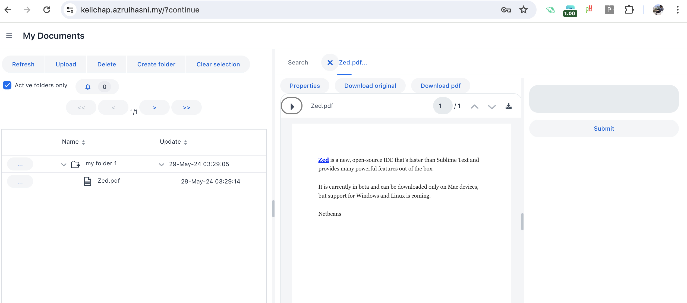

 

###  

 

Setting up for Development on Docker Desktop
--------------------------------------------

 

To run a local development instance, we will leverage Docker Desktop and run the
setup below:

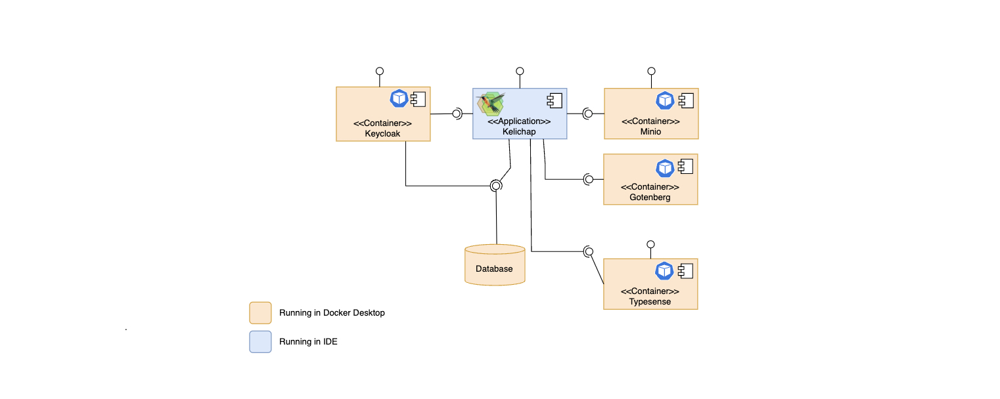

We will install all dependencies in Docker Desktop. By the end of this section,
we will have a list of Docker Containers running as per below:

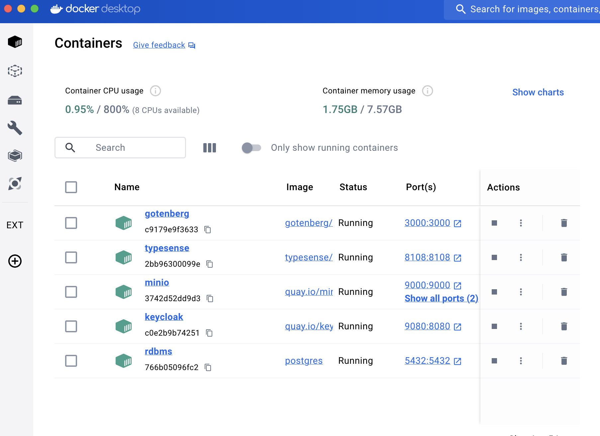

 

**Run database in Docker Desktop**

-   Install and run Postgresql. This will run Posgresql on the default port of
    5432

~~~~~~~~~~~~~~~~~~~~~~~~~~~~~~~~~~~~~~~~~~~~~~~~~~~~~~~~~~~~~~~~~~~~~~~~~~~~~~~~
> docker run --name rdbms -p 5432:5432 -e POSTGRES_PASSWORD=<postgresql admin password> -d postgres
~~~~~~~~~~~~~~~~~~~~~~~~~~~~~~~~~~~~~~~~~~~~~~~~~~~~~~~~~~~~~~~~~~~~~~~~~~~~~~~~

-   Log in to psql. The admin password will be asked. Enter the `<postgresql
    admin password>`above

~~~~~~~~~~~~~~~~~~~~~~~~~~~~~~~~~~~~~~~~~~~~~~~~~~~~~~~~~~~~~~~~~~~~~~~~~~~~~~~~
> docker exec -it rdbms psql -U postgres -W postgres
~~~~~~~~~~~~~~~~~~~~~~~~~~~~~~~~~~~~~~~~~~~~~~~~~~~~~~~~~~~~~~~~~~~~~~~~~~~~~~~~

-   At the prompt, run the SQL query below. This will create a keycloak user in
    the database

~~~~~~~~~~~~~~~~~~~~~~~~~~~~~~~~~~~~~~~~~~~~~~~~~~~~~~~~~~~~~~~~~~~~~~~~~~~~~~~~
postgres=# CREATE ROLE keycloak WITH
  LOGIN
  NOSUPERUSER
  INHERIT
  NOCREATEDB
  NOCREATEROLE
  NOREPLICATION
  NOBYPASSRLS
  PASSWORD '<Keycloak database password>';
~~~~~~~~~~~~~~~~~~~~~~~~~~~~~~~~~~~~~~~~~~~~~~~~~~~~~~~~~~~~~~~~~~~~~~~~~~~~~~~~

-   Now create a keycloak database and assign it to the keycloak user above

~~~~~~~~~~~~~~~~~~~~~~~~~~~~~~~~~~~~~~~~~~~~~~~~~~~~~~~~~~~~~~~~~~~~~~~~~~~~~~~~
postgres=#CREATE DATABASE keycloak
    WITH
    OWNER = keycloak
    ENCODING = 'UTF8'
    LC_COLLATE = 'en_US.utf8'
    LC_CTYPE = 'en_US.utf8'
    LOCALE_PROVIDER = 'libc'
    TABLESPACE = pg_default
    CONNECTION LIMIT = -1
    IS_TEMPLATE = False;
~~~~~~~~~~~~~~~~~~~~~~~~~~~~~~~~~~~~~~~~~~~~~~~~~~~~~~~~~~~~~~~~~~~~~~~~~~~~~~~~

-   Do the same for kelichap database user

~~~~~~~~~~~~~~~~~~~~~~~~~~~~~~~~~~~~~~~~~~~~~~~~~~~~~~~~~~~~~~~~~~~~~~~~~~~~~~~~
postgres=# CREATE ROLE kelichap WITH
  LOGIN
  NOSUPERUSER
  INHERIT
  NOCREATEDB
  NOCREATEROLE
  NOREPLICATION
  NOBYPASSRLS
  PASSWORD '<Kelichap database password>';
~~~~~~~~~~~~~~~~~~~~~~~~~~~~~~~~~~~~~~~~~~~~~~~~~~~~~~~~~~~~~~~~~~~~~~~~~~~~~~~~

-   Now, create a kelichap database

~~~~~~~~~~~~~~~~~~~~~~~~~~~~~~~~~~~~~~~~~~~~~~~~~~~~~~~~~~~~~~~~~~~~~~~~~~~~~~~~
postgres=# CREATE DATABASE kelichap
    WITH
    OWNER = kelichap
    ENCODING = 'UTF8'
    LC_COLLATE = 'en_US.utf8'
    LC_CTYPE = 'en_US.utf8'
    LOCALE_PROVIDER = 'libc'
    TABLESPACE = pg_default
    CONNECTION LIMIT = -1
    IS_TEMPLATE = False;
~~~~~~~~~~~~~~~~~~~~~~~~~~~~~~~~~~~~~~~~~~~~~~~~~~~~~~~~~~~~~~~~~~~~~~~~~~~~~~~~

 

**Run Keycloak in Docker Desktop**

-   Install Keycloak. Note that the Keycloak database password must be the same
    as per paragraph above. Keycloak admin password can be anything. Note the
    db-utl parameter. This must be pointing to the database we installed in the
    earlier paragraph.

~~~~~~~~~~~~~~~~~~~~~~~~~~~~~~~~~~~~~~~~~~~~~~~~~~~~~~~~~~~~~~~~~~~~~~~~~~~~~~~~
> docker run --name keycloak -d -p 9080:8080 \
-e KEYCLOAK_ADMIN=admin \
-e KEYCLOAK_ADMIN_PASSWORD=<Keycloak admin password> \
quay.io/keycloak/keycloak:24.0.4 start-dev \
--db=postgres \
--db-url=jdbc:postgresql://host.docker.internal:5432/keycloak \
--db-username=keycloak \
--db-password=<Keycloak database password>
~~~~~~~~~~~~~~~~~~~~~~~~~~~~~~~~~~~~~~~~~~~~~~~~~~~~~~~~~~~~~~~~~~~~~~~~~~~~~~~~

-   We may want to configure Keycloak as per the paragraph Configuring Keycloak
    above

 

**Run Typesense in Docker Desktop**

-   Install Typesense (v26.0 - we should install the latest version). The
    directory \$(pwd)/typesense-data is where Typesense will store its data.

~~~~~~~~~~~~~~~~~~~~~~~~~~~~~~~~~~~~~~~~~~~~~~~~~~~~~~~~~~~~~~~~~~~~~~~~~~~~~~~~
> export TYPESENSE_API_KEY=<Typesense API key>

> mkdir $(pwd)/typesense-data

> docker run -d --name typesense -p 8108:8108 -v$(pwd)/typesense-data:/data typesense/typesense:26.0 \
  --data-dir /data --api-key=$TYPESENSE_API_KEY --enable-cors
~~~~~~~~~~~~~~~~~~~~~~~~~~~~~~~~~~~~~~~~~~~~~~~~~~~~~~~~~~~~~~~~~~~~~~~~~~~~~~~~

-   Then, install the schema

~~~~~~~~~~~~~~~~~~~~~~~~~~~~~~~~~~~~~~~~~~~~~~~~~~~~~~~~~~~~~~~~~~~~~~~~~~~~~~~~
> curl "http://localhost:8108/collections" -X POST -H "Content-Type: application/json" -H "X-TYPESENSE-API-KEY: ${TYPESENSE_API_KEY}" -d '{
         "name": "kelichap-documents",
         "fields": [
           {"name": "id", "type": "string" , "sort": true },
           {"name": "type_", "type": "string", "sort": true },
           {"name": "docId", "type": "int64" },
           {"name": "tags", "type": "string[]" ,"optional": true},
           {"name": "readers", "type": "string[]" },
           {"name": "workflowId", "type": "string", "sort": true, "optional": true},
           {"name": "folderName", "type": "string", "sort": true  },
           {"name": "folderId", "type": "int64" },
           {"name": "rootFolderId", "type": "int64" },
           {"name": "page", "type": "int32" },
           {"name": "fileName", "type": "string", "sort": true },
           {"name": "size", "type": "int32", "optional": true},
           {"name": "latest", "type": "bool" },
           {"name": "active", "type": "bool" },
           {"name": "pathToRoot", "type": "int64[]" },
           {"name": "version", "type": "int32" },
           {"name": "writerUserName", "type": "string", "optional": true, "sort": true },
           {"name": "writerFullName", "type": "string", "optional": true, "sort": true  },
           {"name": "writtenDate", "type": "int64", "optional": true, "sort": true  },
           {"name": "content", "type": "string" }
         ]
       }'|jq 
~~~~~~~~~~~~~~~~~~~~~~~~~~~~~~~~~~~~~~~~~~~~~~~~~~~~~~~~~~~~~~~~~~~~~~~~~~~~~~~~

 

**Run Minio in Docker Desktop**

-   First, let us decide where would Minio put its stored files. For this
    tutorial, we will user \$(pwd)/minio

-   Then run the command below

~~~~~~~~~~~~~~~~~~~~~~~~~~~~~~~~~~~~~~~~~~~~~~~~~~~~~~~~~~~~~~~~~~~~~~~~~~~~~~~~
> mkdir -p ~/minio/data
> docker run -d \
   -p 9000:9000 \
   -p 9001:9001 \
   --name minio \
   -v ~/minio/data:/data \
   -e "MINIO_ROOT_USER=admin" \
   -e "MINIO_ROOT_PASSWORD=<Minio admin password>" \
   quay.io/minio/minio server /data --console-address ":9001"\
~~~~~~~~~~~~~~~~~~~~~~~~~~~~~~~~~~~~~~~~~~~~~~~~~~~~~~~~~~~~~~~~~~~~~~~~~~~~~~~~

-   Configure Minio as per the Configuring Minio paragraph above

 

**Build and run Kelichap**

-   To build Kelichap for development

~~~~~~~~~~~~~~~~~~~~~~~~~~~~~~~~~~~~~~~~~~~~~~~~~~~~~~~~~~~~~~~~~~~~~~~~~~~~~~~~
> ./mvnw -DskipTests=true clean install
~~~~~~~~~~~~~~~~~~~~~~~~~~~~~~~~~~~~~~~~~~~~~~~~~~~~~~~~~~~~~~~~~~~~~~~~~~~~~~~~

-   To run Kelichap for development

~~~~~~~~~~~~~~~~~~~~~~~~~~~~~~~~~~~~~~~~~~~~~~~~~~~~~~~~~~~~~~~~~~~~~~~~~~~~~~~~
>./mvnw spring-boot:run.
~~~~~~~~~~~~~~~~~~~~~~~~~~~~~~~~~~~~~~~~~~~~~~~~~~~~~~~~~~~~~~~~~~~~~~~~~~~~~~~~

-   To build Kelichap for production, firstly customise the parameters in thee
    jib plugin in the pom.xml file. Point the `<image>` to the registry where we
    want to deploy our image.

~~~~~~~~~~~~~~~~~~~~~~~~~~~~~~~~~~~~~~~~~~~~~~~~~~~~~~~~~~~~~~~~~~~~~~~~~~~~~~~~
 ...
        <plugin>
                <groupId>com.google.cloud.tools</groupId>
                <artifactId>jib-maven-plugin</artifactId>
                <version>3.4.2</version>
                <configuration>
                    <from>
                        <image>gcr.io/distroless/java17-debian12</image>
                    </from>
                    <to>
                        <image>registry.hub.docker.com/azrulhasni/kelichap</image>
                    </to>
                    <container>
                        <ports>
                            <port>18080</port>
                        </ports>
                        <format>Docker</format>
                    </container>
                </configuration>
            </plugin>
...
~~~~~~~~~~~~~~~~~~~~~~~~~~~~~~~~~~~~~~~~~~~~~~~~~~~~~~~~~~~~~~~~~~~~~~~~~~~~~~~~

-   Then, in the settings.xml file, specify the server

~~~~~~~~~~~~~~~~~~~~~~~~~~~~~~~~~~~~~~~~~~~~~~~~~~~~~~~~~~~~~~~~~~~~~~~~~~~~~~~~
...
<servers>
        ...
        <server>
            <id>registry.hub.docker.com</id>
            <username>azrulhasni</username>
            <password>1qazZAQ!</password>
        </server>
    </servers>
...
~~~~~~~~~~~~~~~~~~~~~~~~~~~~~~~~~~~~~~~~~~~~~~~~~~~~~~~~~~~~~~~~~~~~~~~~~~~~~~~~

-   Then build Kelichap with the command below

~~~~~~~~~~~~~~~~~~~~~~~~~~~~~~~~~~~~~~~~~~~~~~~~~~~~~~~~~~~~~~~~~~~~~~~~~~~~~~~~
> ./mvnw -DskipTests=true clean install jib:build -Pproduction
~~~~~~~~~~~~~~~~~~~~~~~~~~~~~~~~~~~~~~~~~~~~~~~~~~~~~~~~~~~~~~~~~~~~~~~~~~~~~~~~

 

 

Configuration
-------------

Configuration is specified in an application.properties file as per below. The
fields are as per below

 

-   **Specify the port on which Kelichap is running**

    -   In application.properties

        ~~~~~~~~~~~~~~~~~~~~~~~~~~~~~~~~~~~~~~~~~~~~~~~~~~~~~~~~~~~~~~~~~~~~~~~~
        server.port=${PORT:18080}
        ~~~~~~~~~~~~~~~~~~~~~~~~~~~~~~~~~~~~~~~~~~~~~~~~~~~~~~~~~~~~~~~~~~~~~~~~

    -   In deployment.yaml

        ~~~~~~~~~~~~~~~~~~~~~~~~~~~~~~~~~~~~~~~~~~~~~~~~~~~~~~~~~~~~~~~~~~~~~~~~
         - name: SERVER_PORT
           value: '${PORT:18080}'
        ~~~~~~~~~~~~~~~~~~~~~~~~~~~~~~~~~~~~~~~~~~~~~~~~~~~~~~~~~~~~~~~~~~~~~~~~

     

-   **Database configuration**

    -   In application.properties

        ~~~~~~~~~~~~~~~~~~~~~~~~~~~~~~~~~~~~~~~~~~~~~~~~~~~~~~~~~~~~~~~~~~~~~~~~
        spring.main.allow-bean-definition-overriding=true
        spring.datasource.url = jdbc:postgresql://localhost:5432/kelichap
        spring.datasource.username = kelichap
        spring.datasource.password = <Database password>
        spring.jpa.hibernate.ddl-auto = update
        spring.jpa.defer-datasource-initialization = true
        ~~~~~~~~~~~~~~~~~~~~~~~~~~~~~~~~~~~~~~~~~~~~~~~~~~~~~~~~~~~~~~~~~~~~~~~~

    -   In deployment.yaml

        ~~~~~~~~~~~~~~~~~~~~~~~~~~~~~~~~~~~~~~~~~~~~~~~~~~~~~~~~~~~~~~~~~~~~~~~~
          - name: SPRING_DATASOURCE_URL
            value: 'jdbc:postgresql://localhost:5432/kelichap'
          - name: SPRING_DATASOURCE_USERNAME
            value: 'kelichap'
          - name: SPRING_DATASOURCE_PASSWORD
            value: <Database password - We can also leverage secrets for this>
          - name: SPRING_JPA_HIBERNATE_DDLAUTO
            value: 'update'
          - name: SPRING_JPA_DEFERDATASOURCEINITIALIZATION
            value: 'true'
        ~~~~~~~~~~~~~~~~~~~~~~~~~~~~~~~~~~~~~~~~~~~~~~~~~~~~~~~~~~~~~~~~~~~~~~~~

 

-   **Spring security configuration**

    -   In application.properties

        ~~~~~~~~~~~~~~~~~~~~~~~~~~~~~~~~~~~~~~~~~~~~~~~~~~~~~~~~~~~~~~~~~~~~~~~~
        spring.security.oauth2.client.registration.keycloak.client-id=kelichap-client
        spring.security.oauth2.client.registration.keycloak.authorization-grant-type=authorization_code
        spring.security.oauth2.client.registration.keycloak.scope=openid
        spring.security.oauth2.client.provider.keycloak.issuer-uri=http://localhost:9080/auth/realms/Kelichap
        spring.security.oauth2.client.provider.keycloak.user-name-attribute=preferred_username

        spring.security.oauth2.resourceserver.jwt.issuer-uri=http://localhost:9080/auth/realms/Kelichap
        spring.security.oauth2.resourceserver.jwt.issuer-uri.jwk-set-uri=http://localhost:9080/auth/realms/Kelichap/protocol/openid-connect/certs

        jwt.auth.converter.resource-id=kelichap-client
        jwt.auth.converter.principal-attribute=preferred_username
        jwt.auth.api.converter.resource-id=kelichap-service
        jwt.auth.api.converter.principal-attribute=preferred_username
        ~~~~~~~~~~~~~~~~~~~~~~~~~~~~~~~~~~~~~~~~~~~~~~~~~~~~~~~~~~~~~~~~~~~~~~~~

    -   In deployment.yaml

        ~~~~~~~~~~~~~~~~~~~~~~~~~~~~~~~~~~~~~~~~~~~~~~~~~~~~~~~~~~~~~~~~~~~~~~~~
          - name: SPRING_SECURITY_OAUTH2_CLIENT_REGISTRATION_KEYCLOAK_CLIENTID
            value: 'kelichap-client'
          - name: SPRING_SECURITY_OAUTH2_CLIENT_REGISTRATION_KEYCLOAK_AUTHORIZATIONGRANTTYPE
            value: 'authorization_code'
          - name: SPRING_SECURITY_OAUTH2_CLIENT_REGISTRATION_KEYCLOAK_SCOPE
            value: 'openid'
          - name: SPRING_SECURITY_OAUTH2_CLIENT_PROVIDER_KEYCLOAK_ISSUERURI
            value: 'http://localhost:9080/realms/Kelichap'
          - name: SPRING_SECURITY_OAUTH2_CLIENT_PROVIDER_KEYCLOAK_USERNAMEATTRIBUTE
            value: 'preferred_username'
          - name: SPRING_SECURITY_OAUTH2_RESOURCESERVER_JWT_ISSUERURI_JWKSETURI
            value: 'http://localhost:9080/realms/Kelichap/protocol/openid-connect/certs'

          - name: JWT_AUTH_CONVERTER_RESOURCEID
            value: 'kelichap-client'
          - name: JWT_AUTH_CONVERTER_PRINCIPALATTRIBUTE
            value: 'preferred_username'
          - name: JWT_AUTH_API_CONVERTER_RESOURCEID
            value: 'kelichap-service'
          - name: JWT_AUTH_API_CONVERTER_PRINCIPALATTRIBUTE
            value: 'preferred_username'
        ~~~~~~~~~~~~~~~~~~~~~~~~~~~~~~~~~~~~~~~~~~~~~~~~~~~~~~~~~~~~~~~~~~~~~~~~

 

-   **Minio configuration**

    -   In application properties

        ~~~~~~~~~~~~~~~~~~~~~~~~~~~~~~~~~~~~~~~~~~~~~~~~~~~~~~~~~~~~~~~~~~~~~~~~
        minio.url=http://localhost:9000
        minio.bucket=kelichap
        minio.access-key=kelichap
        minio.secret-key=<Minio secret>
        ~~~~~~~~~~~~~~~~~~~~~~~~~~~~~~~~~~~~~~~~~~~~~~~~~~~~~~~~~~~~~~~~~~~~~~~~

    -   In deployment.yaml

        ~~~~~~~~~~~~~~~~~~~~~~~~~~~~~~~~~~~~~~~~~~~~~~~~~~~~~~~~~~~~~~~~~~~~~~~~
          - name: MINIO_URL
            value: 'http://localhost:9000'
          - name: MINIO_BUCKET
            value: 'kelichap'
          - name: MINIO_ACCESSKEY
            value: 'kelichap'
          - name: MINIO_SECRETKEY
            value: <Minio secret. We can also leverage secrets for this>
        ~~~~~~~~~~~~~~~~~~~~~~~~~~~~~~~~~~~~~~~~~~~~~~~~~~~~~~~~~~~~~~~~~~~~~~~~

 

-   **Typesense configuration**

    -   In application.properties

        ~~~~~~~~~~~~~~~~~~~~~~~~~~~~~~~~~~~~~~~~~~~~~~~~~~~~~~~~~~~~~~~~~~~~~~~~
        typesense.protocol=http
        typesense.host=localhost
        typesense.port=8108
        typesense.documents.collection=kelichap-documents
        typesense.users.alias=kelichap-users
        typesense.apikey=<Typesense API Key>
        typesense.users.allUsersMaxCount=4 #This is the maximum number of users (i.e. matches the best to our search query) we will return when a search is done 
        ~~~~~~~~~~~~~~~~~~~~~~~~~~~~~~~~~~~~~~~~~~~~~~~~~~~~~~~~~~~~~~~~~~~~~~~~

    -   In deployment.yaml

        ~~~~~~~~~~~~~~~~~~~~~~~~~~~~~~~~~~~~~~~~~~~~~~~~~~~~~~~~~~~~~~~~~~~~~~~~
          - name: TYPESENSE_PROTOCOL
            value: 'http'
          - name: TYPESENSE_HOST
            value: 'localhost'
          - name: TYPESENSE_PORT
            value: '8108'
          - name: TYPESENSE_DOCUMENTS_COLLECTION
            value: 'kelichap-documents'
          - name: TYPESENSE_USERS_ALIAS
            value: 'kelichap-users'
          - name: TYPESENSE_USERS_ALLUSERSMAXCOUNT
            value: '4'
          - name: TYPESENSE_APIKEY
            value: '<Typesense API Key. Wee can also leverage secret for this>'
        ~~~~~~~~~~~~~~~~~~~~~~~~~~~~~~~~~~~~~~~~~~~~~~~~~~~~~~~~~~~~~~~~~~~~~~~~

 

-   **Upload configuration (for API)**

    -   In application.properties

        ~~~~~~~~~~~~~~~~~~~~~~~~~~~~~~~~~~~~~~~~~~~~~~~~~~~~~~~~~~~~~~~~~~~~~~~~
        executor.thread-count=10
        spring.servlet.multipart.max-file-size=20MB
        spring.servlet.multipart.max-request-size=20MB
        server.tomcat.max-swallow-size=-1
        ~~~~~~~~~~~~~~~~~~~~~~~~~~~~~~~~~~~~~~~~~~~~~~~~~~~~~~~~~~~~~~~~~~~~~~~~

    -   In deployment.yaml

        ~~~~~~~~~~~~~~~~~~~~~~~~~~~~~~~~~~~~~~~~~~~~~~~~~~~~~~~~~~~~~~~~~~~~~~~~
        - name: EXECUTOR_THREADCOUNT
          value: '10'
        - name: SPRING_SERVLET_MULTIPART_MAXFILESIZE
          value: '20MB'
        - name: SPRING_SERVLET_MULTIPART_MAXREQUESTSIZE
          value: '20MB'
        - name: SERVER_TOMCAT_MAXSWALLOWSIZE
          value: '-1'
        ~~~~~~~~~~~~~~~~~~~~~~~~~~~~~~~~~~~~~~~~~~~~~~~~~~~~~~~~~~~~~~~~~~~~~~~~

 

-   **Upload configuration (for UI)**

    Note that the API upload configuration must be bigger than or equal to the
    file size limit here

    -   In application.properties

        ~~~~~~~~~~~~~~~~~~~~~~~~~~~~~~~~~~~~~~~~~~~~~~~~~~~~~~~~~~~~~~~~~~~~~~~~
        kelichap.maxFileCountPerUpload=5
        kelichap.maxFileSize=4000000
        ~~~~~~~~~~~~~~~~~~~~~~~~~~~~~~~~~~~~~~~~~~~~~~~~~~~~~~~~~~~~~~~~~~~~~~~~

    -   In deployment.yaml

        ~~~~~~~~~~~~~~~~~~~~~~~~~~~~~~~~~~~~~~~~~~~~~~~~~~~~~~~~~~~~~~~~~~~~~~~~
        - name: KELICHAP_MAXFILECOUNTPERUPLOAD
          value: '5'
        - name: KELICHAP_MAXFILESIZE
          value: '12000000'
        ~~~~~~~~~~~~~~~~~~~~~~~~~~~~~~~~~~~~~~~~~~~~~~~~~~~~~~~~~~~~~~~~~~~~~~~~

         

-   **Keycloak configuration**

    This is to be used to query user information from Keycloak. The user
    configured below was described in the paragraph Configuring Keycloak -
    System User above

    -   In application.properties

        ~~~~~~~~~~~~~~~~~~~~~~~~~~~~~~~~~~~~~~~~~~~~~~~~~~~~~~~~~~~~~~~~~~~~~~~~
        kelichap.keycloak.username=kelichap
        kelichap.keycloak.password=<Keycloak user password>
        kelichap.keycloak.url=http://localhost:9080/auth
        kelichap.keycloak.client-id=kelichap-client
        kelichap.keycloak.realm=Kelichap
        ~~~~~~~~~~~~~~~~~~~~~~~~~~~~~~~~~~~~~~~~~~~~~~~~~~~~~~~~~~~~~~~~~~~~~~~~

    -   In deployment.yaml

        ~~~~~~~~~~~~~~~~~~~~~~~~~~~~~~~~~~~~~~~~~~~~~~~~~~~~~~~~~~~~~~~~~~~~~~~~
          - name: KELICHAP_KEYCLOAK_USERNAME
            value: 'kelichap'
          - name: KELICHAP_KEYCLOAK_PASSWORD
            value: <Keycloak user password. Wee can also leverage secrets for this>
          - name: KELICHAP_KEYCLOAK_URL
            value: 'http://localhost:9080/auth'
          - name: KELICHAP_KEYCLOAK_CLIENTID
            value: 'kelichap-client'
          - name: KELICHAP_KEYCLOAK_REALM
            value: 'Kelichap'
        ~~~~~~~~~~~~~~~~~~~~~~~~~~~~~~~~~~~~~~~~~~~~~~~~~~~~~~~~~~~~~~~~~~~~~~~~

 

-   **User sync configuration**

    -   We can sync user from Keycloak to Typesense through the configuration
        below. This will allow us to search for users

    -   Note: Keycloak could also be connected to Active Directorry or LDAP - in
        which case, wee will copy the user information directly from those
        systems

        ~~~~~~~~~~~~~~~~~~~~~~~~~~~~~~~~~~~~~~~~~~~~~~~~~~~~~~~~~~~~~~~~~~~~~~~~
        kelichap.keycloak.typesense.usersync.cron=0 0 0 * * *
        kelichap.keycloak.typesense.usersync.batchsize=100
        kelichap.keycloak.typesense.usersync.immediateafterrun=true
        kelichap.keycloak.typesense.usersync.immediateruncopyoonlyonempty=false
        ~~~~~~~~~~~~~~~~~~~~~~~~~~~~~~~~~~~~~~~~~~~~~~~~~~~~~~~~~~~~~~~~~~~~~~~~

    -   In deployment.yaml

        ~~~~~~~~~~~~~~~~~~~~~~~~~~~~~~~~~~~~~~~~~~~~~~~~~~~~~~~~~~~~~~~~~~~~~~~~
        - name: KELICHAP_KEYCLOAK_TYPESENSE_USERSYNC_CRON
          value: '0 0 0 * * *'
        - name: KELICHAP_KEYCLOAK_TYPESENSE_USERSYNC_BATCHSIZE
          value: '100'
        - name: KELICHAP_KEYCLOAK_TYPESENSE_USERSYNC_IMMEDIATEAFTERRUN
          value: 'true'
        - name: KELICHAP_KEYCLOAK_TYPESENSE_USERSYNC_IMMEDIATERUNCOPYOONLYONEMPTY
          value: 'false'
        ~~~~~~~~~~~~~~~~~~~~~~~~~~~~~~~~~~~~~~~~~~~~~~~~~~~~~~~~~~~~~~~~~~~~~~~~

 

-   **Gotenberg configuration**

    -   In application.properties

        ~~~~~~~~~~~~~~~~~~~~~~~~~~~~~~~~~~~~~~~~~~~~~~~~~~~~~~~~~~~~~~~~~~~~~~~~
        gotenberg.url=http://localhost:3000
        ~~~~~~~~~~~~~~~~~~~~~~~~~~~~~~~~~~~~~~~~~~~~~~~~~~~~~~~~~~~~~~~~~~~~~~~~

    -   In deployment.yaml

        ~~~~~~~~~~~~~~~~~~~~~~~~~~~~~~~~~~~~~~~~~~~~~~~~~~~~~~~~~~~~~~~~~~~~~~~~
        - name: GOTENBERG_URL
          value: 'http://localhost:3000'
        ~~~~~~~~~~~~~~~~~~~~~~~~~~~~~~~~~~~~~~~~~~~~~~~~~~~~~~~~~~~~~~~~~~~~~~~~

 

-   **Kelichap configuration**

    -   In application.properties

        ~~~~~~~~~~~~~~~~~~~~~~~~~~~~~~~~~~~~~~~~~~~~~~~~~~~~~~~~~~~~~~~~~~~~~~~~
        kelichap.documentNameMaxLength=10
        kelichap.folderCountPerPage=7
        kelichap.auditRecordCountPerPage=7
        kelichap.notesCountPerPage=5
        ~~~~~~~~~~~~~~~~~~~~~~~~~~~~~~~~~~~~~~~~~~~~~~~~~~~~~~~~~~~~~~~~~~~~~~~~

    -   In deployment.yaml

        ~~~~~~~~~~~~~~~~~~~~~~~~~~~~~~~~~~~~~~~~~~~~~~~~~~~~~~~~~~~~~~~~~~~~~~~~
          - name: KELICHAP_DOCUMENTNAMEMAXLENGTH
            value: '10'
          - name: KELICHAP_FOLDERCOUNTPERPAGE
            value: '7'
          - name: KELICHAP_AUDITRECORDCOUNTPERPAGE
            value: '7'
          - name: KELICHAP_NOTESCOUNTPERPAGE
            value: '5'
        ~~~~~~~~~~~~~~~~~~~~~~~~~~~~~~~~~~~~~~~~~~~~~~~~~~~~~~~~~~~~~~~~~~~~~~~~

 
