Kelichap: Enterprise Document Management System (EDMS) for workflow
===================================================================

 

User Manual
===========

 

Current version 1.1

 

 

### Landing page 

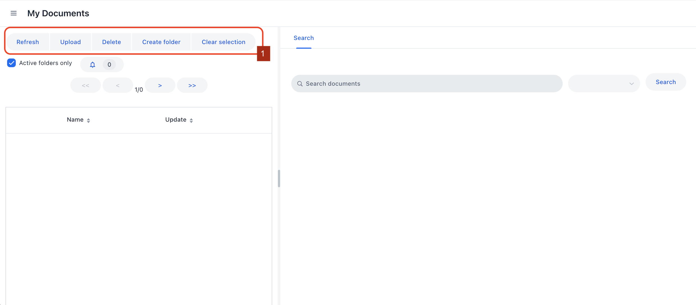

-   Once we log in, we will see the landing page above

-   The control bar on top is where we would probably start. Folders could be
    created and documents could be uploaded using these buttons

 

### Creating a folder

-   When we click on the ‘Create folder’ button, a popup will appear.

    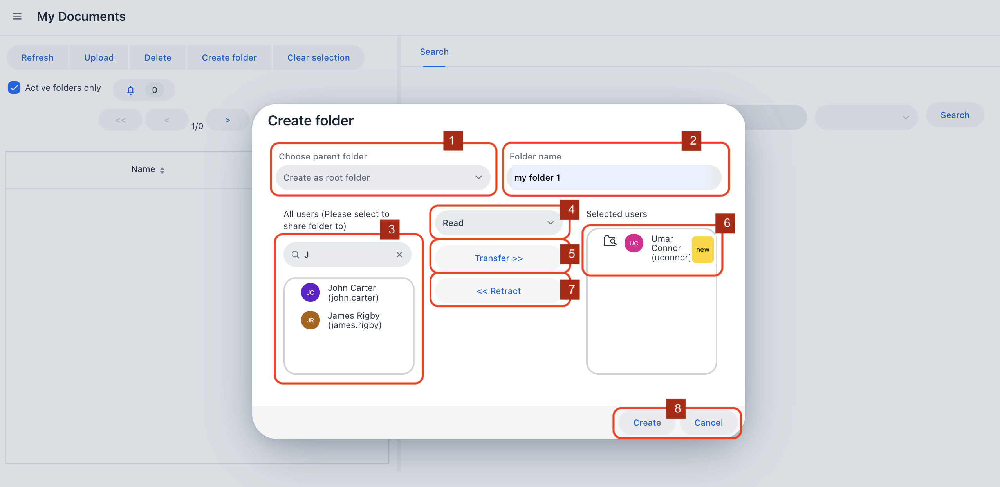

1.  This is the parent folder. There are two ways to create a folder under
    another (parent) folder

    -   Highlight a folder in the folder tree and click on the ‘Create folder’
        button - by which ‘Choose parent folder’ drop down will have the
        highlighted parent folder appearing in there

    -   Choose the parent folder from the drop down

    Leaving the the ‘Choose parent folder’ empty will create a folder without a
    parent (a root folder).

    Note that there can be many root folders

2.  Folder name

3.  Next, select users who can access the folder. The ‘All users’ field is a
    search field. We can search any user from here. In the example, when we type
    ‘J’ both John Carter and James Rigby appears. We can select one or many

4.  Once a user is selected (or multiple users are selected), we can assign them
    rights. Note that we assign the same rights to all selected users. If you
    want to give different rights to different users, you will have to do this
    twice.

 

>   **Access right too a folder**

>   The are 2 access rights

>   **Read:** A user can read the content of a folder

>   ** Create and update: **A user can upload and modify (e.g. add tags) the
>   content of a folder. A user can also create      other folders  under this
>   folder

 

1.  Click Transfer to indicate that the selected users, with the selected rights
    will have access to this folder

2.  This is the list of transfered users. These users will have access to this
    folder I am creating once creation is complete

    

    -   This icon indicates that the selected user has ‘Create and update’
        access right to the folder

        

        -   This icon indicates that the selected user has ‘Read’ access right
            to the folder

3.  We can remove a selected user by selecting the user and clicking on
    ‘Retract'

4.  Once we are happy, click on ‘Create’ to create the folder

 

### Navigating in the folder tree

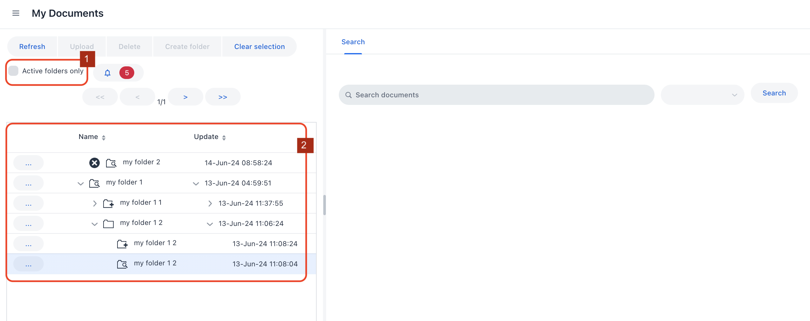

1.  One of the goal of Kelichap is to be the document back end for a workflow
    application - to enable this, we must have a way to indicate that the
    workflow has ended and case is closed. We indicate this by controlling the
    ‘active’ state of a folder. By default, in-active folders are not visible.
    To show in-active folders, un-select the ‘Active folders only’ checkbox.

 

>   **Active / In-active status**

>   An in-active folder is ‘locked’. Only the owner (i.e. creator) of a folder
>   can toggle its active status (active to in-active , in-active to active) .

>   When the ‘Active folders only’ checkbox in selected, then in-active folders
>   are invisible and documents within these folders are not readable nor
>   searchable.

>   When  the ‘Active folders only’ checkbox in de-selected, then in-active
>   folders are visible, documents within these folders are readable and
>   searchable but the folders are locked from any upload

 

1.  The red box designate the folder tree. The folder tree is the navigation
    tool where we can see all the folders accessible to us. It displays the
    accessibility of the folder, the name of the folder, and update date.

 

-   This icon indicates that the current user has ‘Create and update’ access
    right to the folder. The user can read, upload, and search documents in this
    folder. The user can also add more sub folders under this folder

    

    -   This icon indicates that the current user has ‘Read’ access right to the
        folder. The user can read and search documents in this folder

        

        -   This icon indicates that the current user has ‘Restricted’ access
            right to the folder. The user can open this folder and open sub
            folders under this folder, but the user will not be able to access
            (or even see) documents in this folder

        

        -   Any folder preceded with this icon indicate that the folder is
            in-active

         

>   **Restricted access**

>   What if a user has access to a sub-folder but not to the parent folder? The
>   user will be ‘deprived’ of access to the sub-folder since she cannot
>   navigate to the sub-folder.

>   To help with this, Kelichap introduces a ‘Restricted’ access as specified
>   above.

>   When a sub-folder is made accessible to a user (either ‘Read’ for ‘Create
>   and update’), the parent folder, going all the way to the root, will also be
>   made accessible to the user as Restricted.

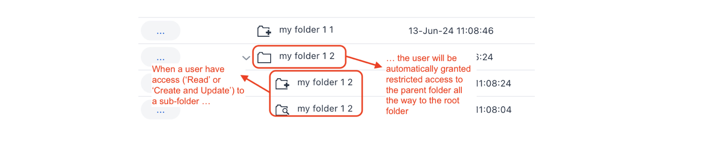

### Editing a folder

-   To edit a folder, click on the elipses button next to the folder name in the
    folder tree

    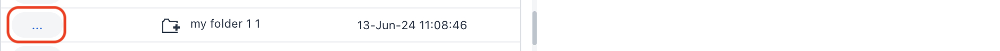

-   A popup window will appear

    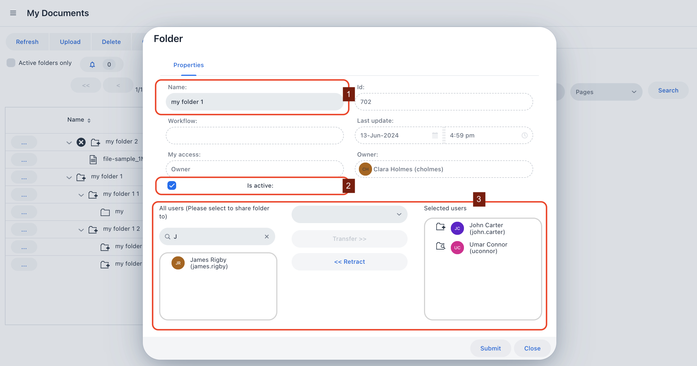

    1.  The name of a folder can be modified (with access right: Create and
        update)

    2.  The active state of a folder can bee modified (only the owner / creator
        of a folder can change this)

    3.  New users can be given access and current users can be retracted from
        access of a folder (with access right: Create and update)

-   Click on ’Submit’ to make changes to the folder permanent

 

### Uploading a document

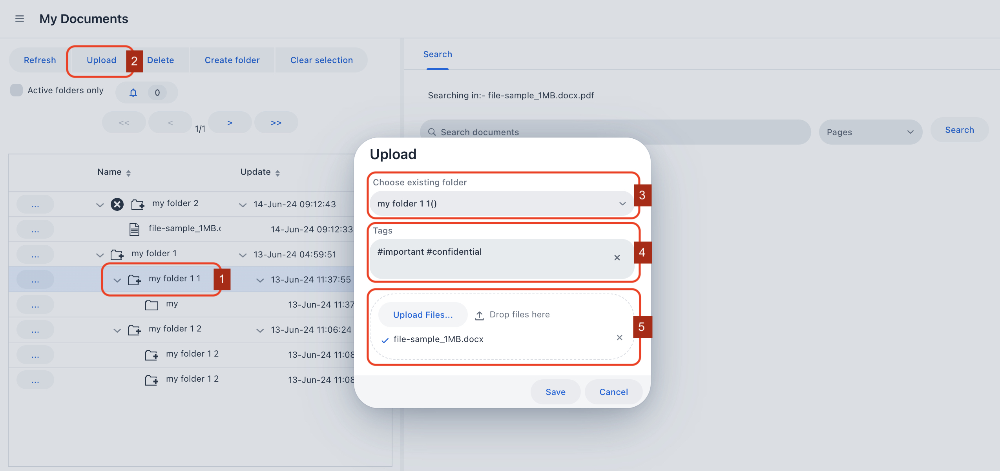

-   To upload a document:

    1.  Choose a folder where the document will be uploaded

    2.  Click on the ‘Upload’ button

    3.  Alternatively, the folder where the document will be uploaded can be
        selected in the field ‘Choose existing folder'

    4.  Tags can be specified in the ’Tags’ field. When a \# character is typed,
        the system will list all the available tags in the system. User can
        choose among many tags shown.

    5.  Click on the ‘Upload Files’ button and choose a document. Click on
        ’Save’ too permanently save the document. Note that the uploaded file
        will be converted to pdf for viewing but user will still have access to
        the original version.

 

>   **Supported file format**

>   Support for multiple files through Gotenberg
>   [<https://gotenberg.dev/docs/6.x/office>]

>   ` .txt`

>   ` .rtf`

>   ` .fodt`

>   ` .doc`

>   ` .docx`

>   ` .odt`

>   ` .xls`

>   ` .xlsx`

>   ` .ods`

>   ` .ppt`

>   ` .pptx`

>   ` .odp`

 

### Updating a document and versioning

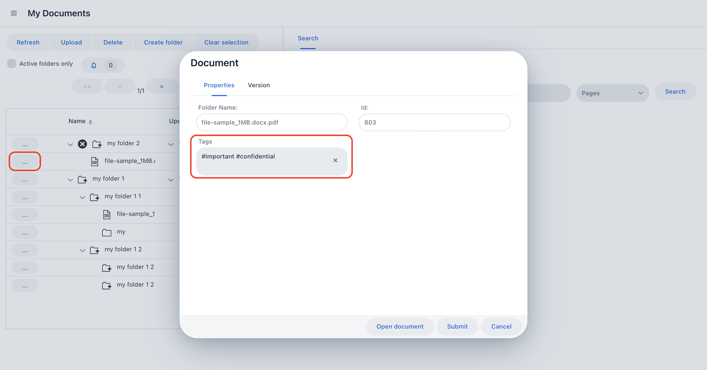

-   Clicking on the ellipsis button next to a document will bring up the popup
    window above. Tags can be modified if the user has ‘Create and update’
    access right

 

>   **Versioning**

>   To create a new version of a document, upload a new version of a document
>   with the same name. The system will recognise this and track it in the
>   Version tab.

>   Note: although an earlier version of a document is available to be read,
>   search could only be done on thee latest version of a document.

 

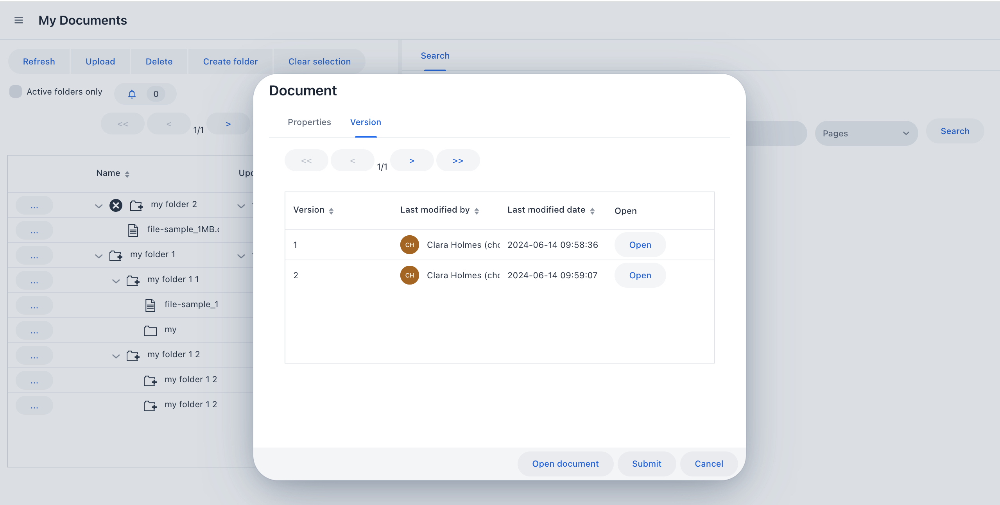

 

### Viewing a document

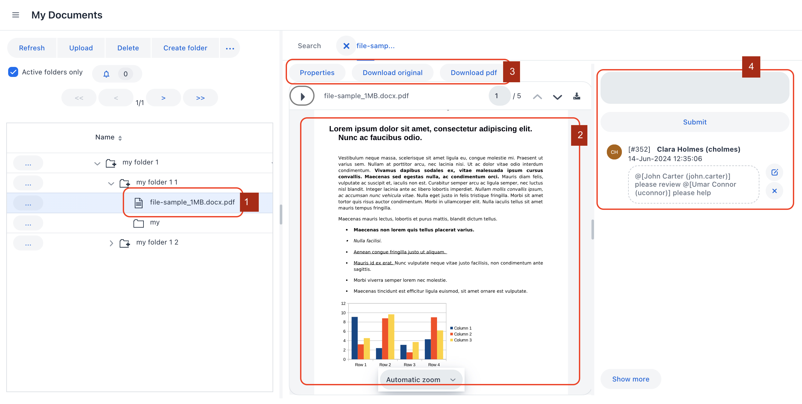

1.  Double clicking on a document in the folder tree will bring it up said
    document in the Document viewer

2.  The document viewer will display the pdf version of the document

3.  If the original version of the document was other than pdf, user can opt to
    download either the converted (to pdf) version or the ooriginal version

4.  User can also leave notes attached to the document. Any other user who has,
    either a ‘Read' access or 'Create and Update’ access to the containing
    folder of this document will be able to see (and reply to) the notes.  Other
    users (having at least a Read access to the document) can be mentioned by
    using the character ‘\@'

    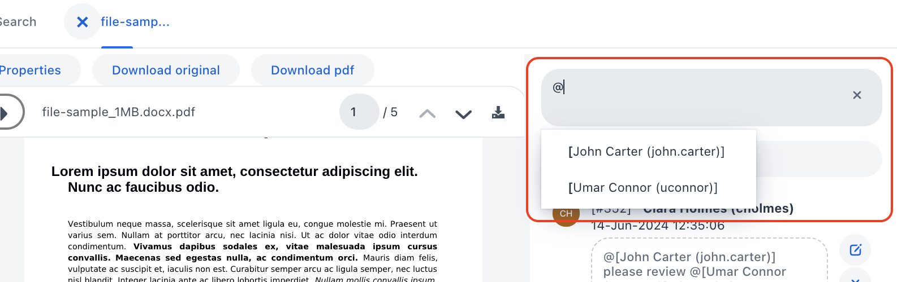

 

### Notification

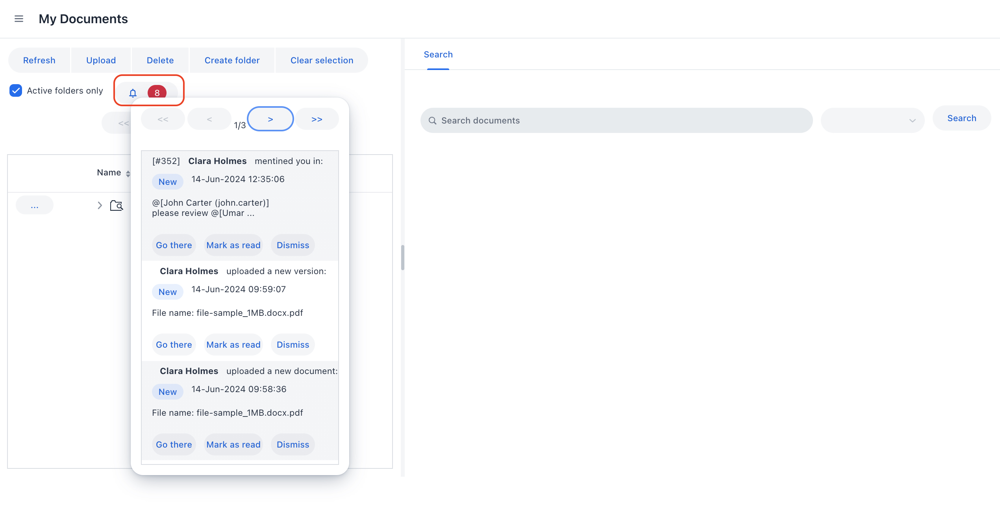

-   Kelichap is equipped with an internal notification feature. Notification is
    sent to a particular user when:

    -   Another user mentions this particular user in a document’s note

    -   Another user share a folder with this particular user

    -   Another user requests access to a folder created by this particular user

-   When a notification is ‘Mark as read’, it will no longer appear as a red
    number in the alert

-   To delete notification, simply dismiss it by clicking ‘Dismiss'

 

### Requesting access

-   A user can request access to a restricted folder from the creator of that
    folder.

    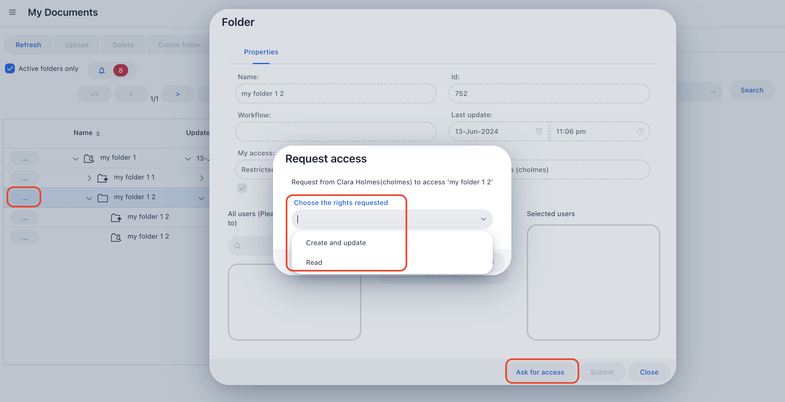

-   The user need to click on the ellipses button next to the restricted folder
    he would like to access, and open up the Folderr properties window

-   Click on ‘Ask for access'

-   Choose the level of access she would like to obtain, and click on ’Send
    request'

-   On the folder owner side, the owner will receive a notification

    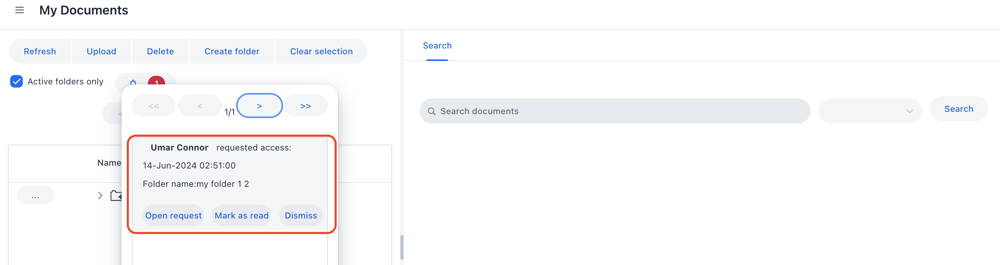

-   Clicking on ‘Open request’, a new popup window will appear

    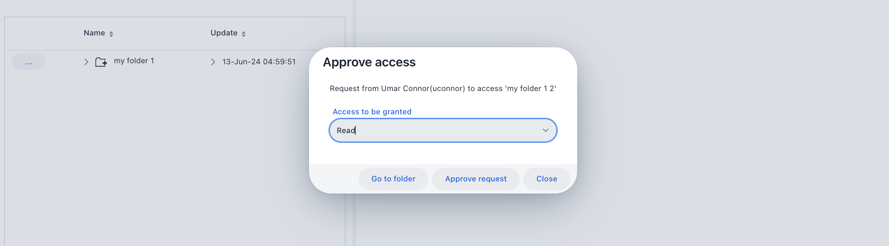

-   The user can see the requestor, the access rights requested and the folder
    name in question. The user can click on ‘Go to folder’ to see more details
    of the folder.

-   Once the user is happy, the user can either approve the request or modify
    the request before approving

-   If the user do not want to approve the request, simply dismiss the
    notification

 

### Searching

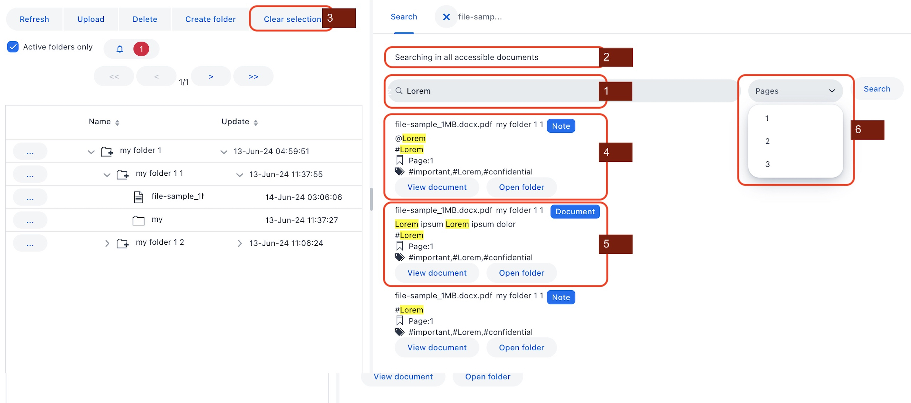

1.  To search, choose the ’Search’ tab and type the search query in the search
    field. Key in ‘Enter’ or click on the ’Search’ button. The result of the
    search will appear

2.  Thee search will naturally covers all documents in all accessible folders.
    If the user wants to search a particular folder for a particular document,
    highlight the document in the folder tree and do the search. In this case,
    only thee selected folder or document is searched.

3.  To clear the selection of a folder in folder tree, click on ‘Clear
    selection'

4.  Not only we will search the content of a document, but also the Notes
    attached to documents

5.  From a document point of view, the content and the tags of a document is
    searched. Matching keywords are highlighted.

6.  When the search returns too many result to display on a page, the system
    will page the results accordingly. These pages can be accessed from the
    ‘Pages’ droop down list

 

>   **Typo-proof search**

>   The search technology we used fast and resilient to typo

 

### Administration

-   To have access to the administration function, create a user (e.g.
    kelichap.admin)

-   This user must have the role of “KELICHAP_ADMIN” in Keycloak. The role must
    be registered in the Keycloak client “kelichap-client"

    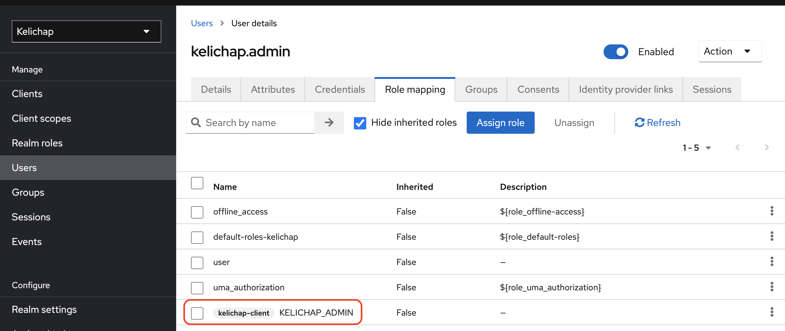

**Re-assigning user**

-   There will be times when folders are owned or assigned to a user but the
    user may not be able to work on it  any longer (in cases of resignation,
    dismissal or promotion)

-   The administration interface is equipped with a way to re-assign all these
    folders to a new user

-   Simply fill in the ’From’ and ’To’ fields and click on Submit. Click on
    buttons ’Select from’ and ’Select to’ to search for the users

    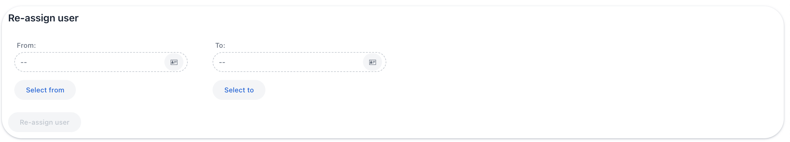

**Managing folders**

-   The administrator can manage folders. She can search for a folder and open
    it in the folder tree.

-   Note that the administrator cannot read documents

    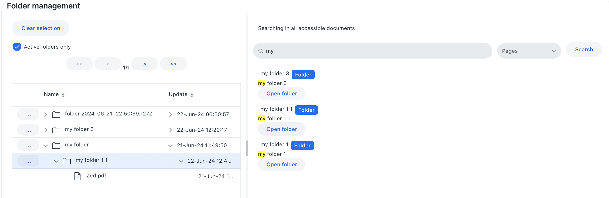

-   By clicking on the properties button (. . . ) next to the folder, the
    administrator can :

    -   Activate / De-activate a folder

    -   Assign / Retract user access to a folderr

    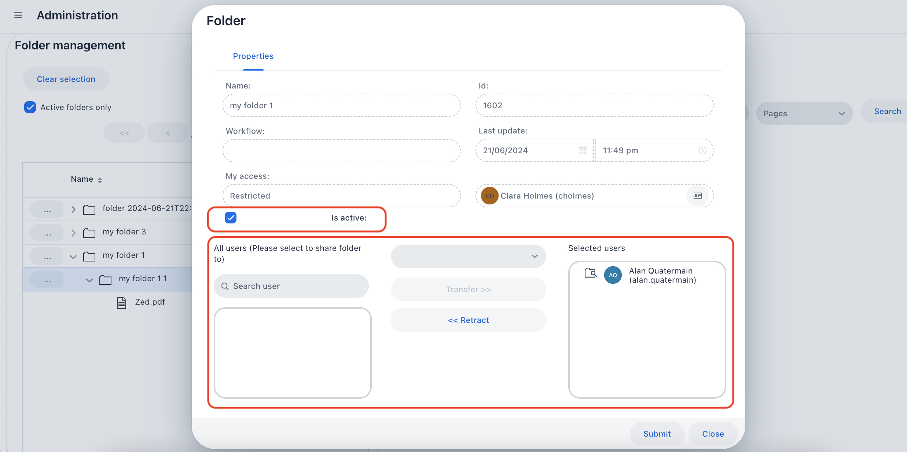

 

### Audit trail

-   Audit trail is kept in the database directly. For each table (except for
    Notification), an equivalent audit table is present where all audit trail
    information are kept.

-   Revinfo table kept the mapping of audit revision number againts a timestamp

    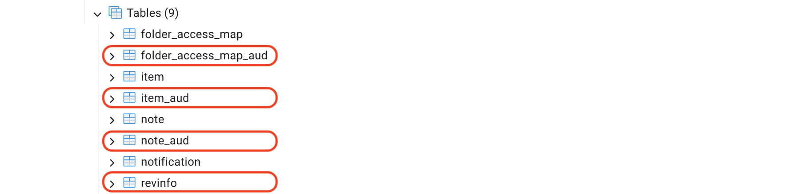

-   Each audit table is equipped with tracking fields

    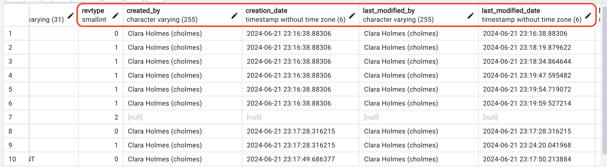

-   The field revtype indicate the type of changes

    -   0: creation

    -   1: update

    -   2: deletion

 
